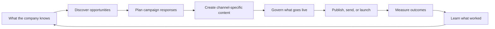
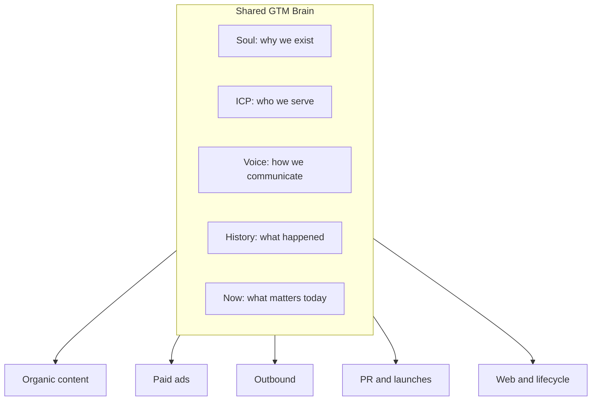
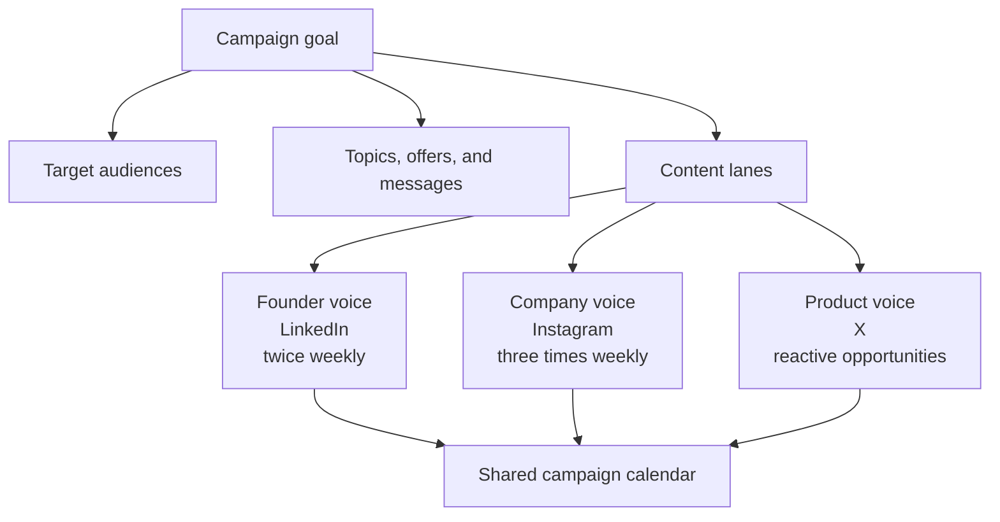
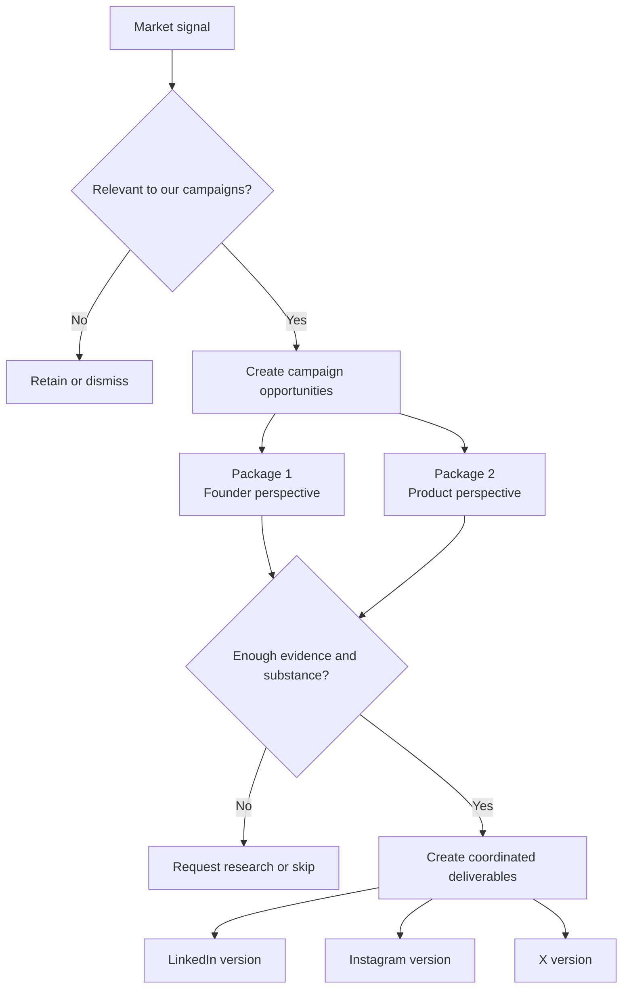
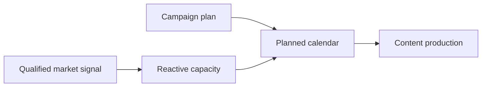
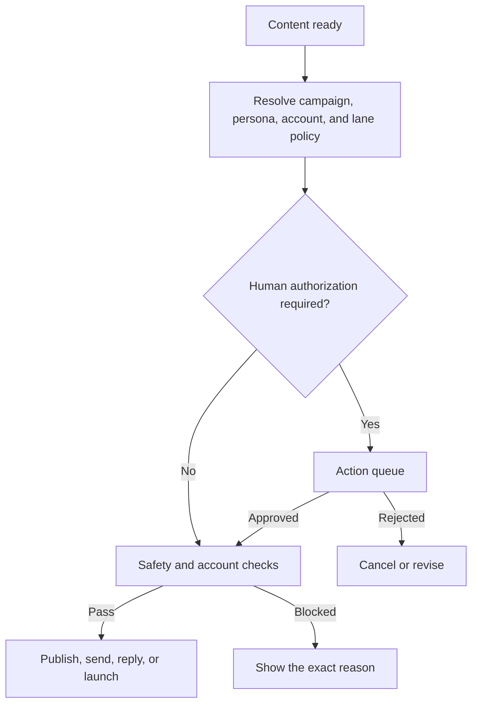
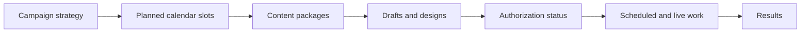
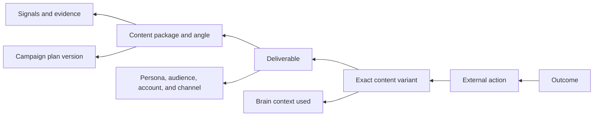
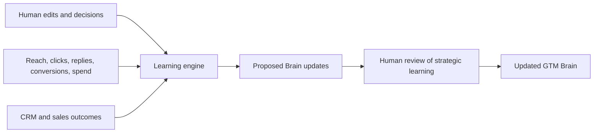
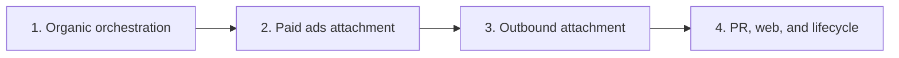

# Tuezday: How the GTM Orchestration Platform Works

> Leadership and marketing overview
> Date: 2026-07-11

## The Platform In One Sentence

Tuezday continuously turns company knowledge and market signals into coordinated campaigns across
multiple voices and channels, governs what is allowed to go live, measures the response, and uses the
result to improve the next campaign.

It is not simply an AI writer, scheduler, ads tool, or outbound tool. It is the shared planning,
memory, and decision layer connecting those activities.

## The Operating Loop

The important difference is the final arrow. Results do not end in a dashboard. They return to the
shared GTM Brain so future work starts with what the company has already learned.

## The Shared GTM Brain

The Brain is the common memory used by every campaign and channel.

The Brain is human-readable and editable. Tuezday also records which parts of the Brain influenced a
specific output, so teams can understand why something was created instead of trusting a black box.

## How Campaigns Organize Everything

Every GTM action belongs to a campaign, including always-on activity. An "Always-on founder voice"
campaign may run continuously, while a product launch campaign has a fixed start and end date.

A content lane says who is speaking, which audience they are addressing, where the content will go,
what kind of content it should be, how often it should appear, and whether a human must authorize it
before it leaves Tuezday.

This keeps "who speaks" separate from "who receives":

- A **persona** is the founder, company brand, employee advocate, or other speaking identity.
- An **audience** is the customer, prospect, journalist, community member, or market segment being
  addressed.

One campaign can use several personas and audiences without mixing their voices or publishing through
the wrong accounts.

## From Market Signal To Coordinated Content

Tuezday watches selected sources, connected channels, competitors, and other market inputs. It does
not publish every signal it finds.

One signal can support several content packages when different campaigns have genuinely different
angles. Before content is drafted, Tuezday checks whether the source material can support those angles
and formats. It should ask for more evidence or skip an item rather than stretch a thin signal into
generic content.

Each channel receives an adapted version. The platform does not simply paste the same caption
everywhere.

## Planned And Reactive Work Together

Campaigns contain two kinds of work:

- **Planned work** keeps the calendar consistent: scheduled topics, recurring formats, launches, and
  campaign milestones.
- **Reactive work** lets relevant discoveries enter the campaign when they clear relevance, quality,
  repetition, and volume limits.

Reactive limits prevent a busy news cycle from flooding every connected account or displacing the
campaign's planned message.

## What Autonomy Means

Tuezday can discover, plan, research, and draft continuously. Customers decide where a human must
intervene before the system acts externally.

A customer can make a campaign fully autonomous while requiring every post from the founder persona
to be approved. The more restrictive applicable rule wins. Tuezday shows which rule caused the gate.

The governed external actions are:

- publishing or sending
- automated replies
- launching paid spend
- changing a live budget
- changing live targeting

Safety limits remain active even when a customer allows autonomous action.

## The Calendar Is The Daily Operating Surface

The campaign strategy becomes visible work before content is generated.

The calendar shows:

- work planned but not yet filled
- content currently being created
- items waiting for authorization
- scheduled actions
- successful and failed actions

This lets leadership see whether a campaign is actually being executed, not only whether documents
have been generated.

## Traceability From Result Back To Decision

Every published or sent item has a traceable lineage.

This makes it possible to answer questions such as:

- Which message worked for this audience?
- Which persona performed best on this topic?
- Which source signals led to useful content?
- Did an edited variant outperform the original?
- Did paid and organic executions of the same idea reinforce each other?
- What should the company repeat, change, or stop saying?

## How The Platform Learns

Learning combines human judgment and market behavior.

Tuezday may automate execution, but it should not silently rewrite the company's strategy or voice.
Important Brain changes remain inspectable proposals.

## Organic First, Then Paid And Outbound

The platform is being connected in a deliberate order.

### Stage 1: Organic orchestration

Proves campaign planning, personas, audiences, accounts, discovery, packages, calendar execution,
authorization, publishing, and learning in one working loop.

### Stage 2: Paid ads

Uses the same campaign packages and variants. Adds ad formats, ad accounts, budgets, targeting,
spend authorization, launch controls, and paid outcomes.

### Stage 3: Outbound

Uses the same campaign angle and audience logic. Adds lists, sender accounts, personalized sequences,
sending windows, stop-on-reply controls, replies, meetings, and CRM outcomes.

### Stage 4: Additional GTM channels

PR, web, lifecycle messaging, and future channels attach to the same campaign and action model rather
than becoming separate products inside the product.

## Example: One Signal Across The Platform

A competitor announces a new AI feature.

1. Discovery finds the announcement and judges it relevant to two campaigns.
2. The evergreen founder campaign creates a package about what the announcement means for the market.
3. The product campaign creates a separate package comparing the approaches with supported evidence.
4. Each package is checked for sufficient facts, distinct framing, and repetition risk.
5. The founder package produces a LinkedIn post and X post in the founder persona.
6. The product package produces a company-page carousel and, later, paid ad variants.
7. The founder persona requires authorization, so those actions wait in the queue.
8. The company page is allowed to publish autonomously after safety checks.
9. Results are attributed to the exact variants, packages, personas, audiences, and source signal.
10. Tuezday proposes what the company should learn from the combined response.

## What Leadership Should Expect To See

The platform should make five questions answerable at a glance:

1. **What are we trying to achieve?** Active campaigns and their goals.
2. **What is the system doing next?** Planned calendar and production status.
3. **What needs human attention?** Authorization, research gaps, stale work, and failed actions.
4. **What is working?** Outcomes by campaign, package, persona, audience, channel, and source.
5. **What did we learn?** Proposed changes to the shared GTM Brain.

## The Product Promise

Tuezday should feel like one GTM operation, not a collection of AI tools.

The system remembers the company, watches the market, plans coordinated responses, creates work in
the correct voices, respects each customer's autonomy rules, executes through connected channels,
and turns results into reusable learning.

That is what "end-to-end GTM orchestration" means in practical terms.
