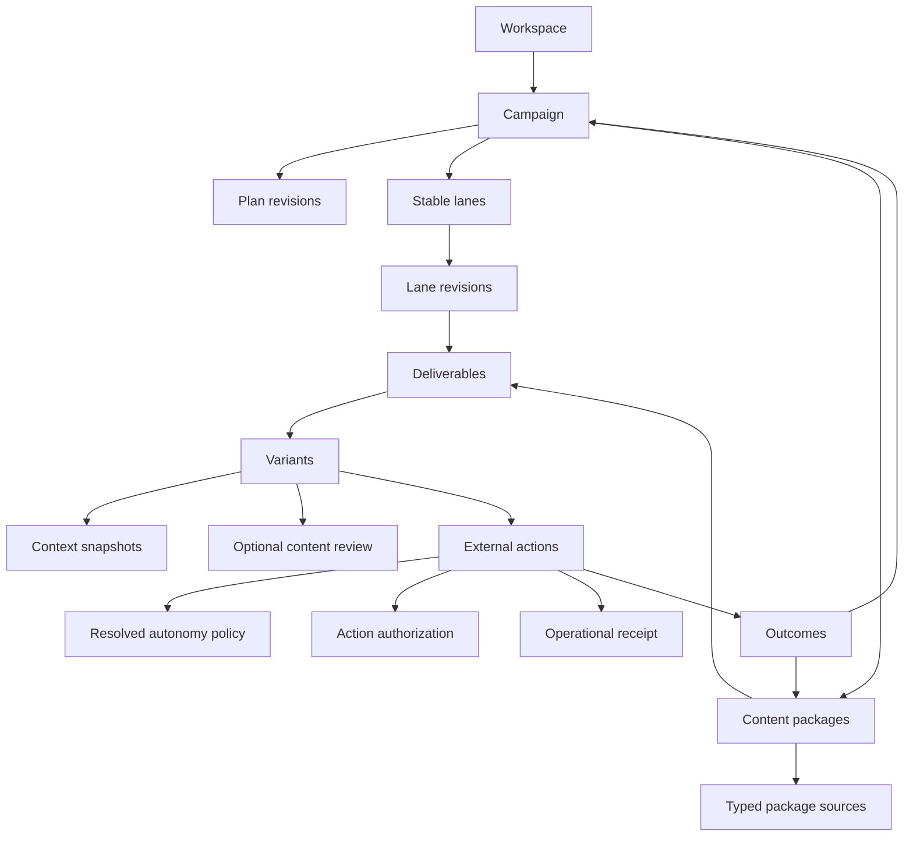
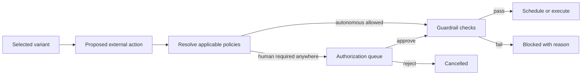
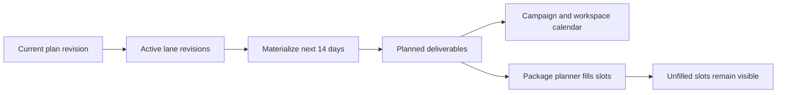
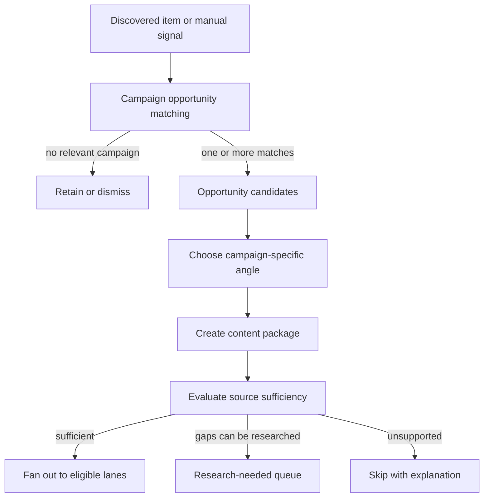

# GTM Orchestration Control Plane Design

> Status: ready for founder review
> Date: 2026-07-11
> Initial delivery: organic social orchestration
> Planned attachments: paid ads, outbound, PR, web, and lifecycle

## Purpose

Tuezday already has working vertical slices for the Brain, discovery, generation, approvals,
campaigns, social publishing, ads, outbound, PR, analytics, and learning. The missing layer is a
shared execution model that turns a campaign into coordinated, traceable work across those slices.

This design adds that control plane. Every GTM action belongs to a campaign. Campaign intent becomes
a versioned plan; the plan produces content packages and concrete deliverables; deliverables produce
variants; selected variants produce governed external actions; outcomes flow back to the package,
persona, audience, source, and campaign that caused them.

Organic social proves the model first. Ads and outbound are explicitly designed as the next adapters,
not postponed architecture decisions.

## Product Decisions

1. Every GTM action belongs to a campaign. Always-on work belongs to an evergreen campaign.
2. A persona is the identity speaking. An audience is the group being targeted.
3. Campaigns combine planned output with bounded reactive output from discovery.
4. Discovery, routing, research, and drafting may run autonomously without separate human gates.
5. Human authorization applies at external-action boundaries: publish/send, automated reply, paid
   launch, budget change, and targeting change.
6. Autonomy is configurable at workspace, campaign, persona, publishing connection, and lane scope.
   An applicable `human_required` rule wins over an autonomous rule.
7. One discovery signal may create several campaign-specific content packages with different angles.
8. A package must pass a content-sufficiency check before deliverables are generated. The system must
   request more research or skip unsupported deliverables instead of inventing material.
9. Changes preserve published history. Affected unpublished work becomes stale with an explanation
   and may be selectively regenerated.
10. Organic social is the first implementation milestone. Ads and outbound attach immediately after
    organic acceptance through the same external-action and outcome contracts.

## Current Gaps

The current repository has capable modules but no single execution graph:

- `campaigns` stores channels and persona IDs as JSON arrays. It expresses intent but not quantities,
  formats, dates, account assignments, fulfillment, or plan history.
- Discovery routes a signal to persona/campaign matches, while automation independently fans signals
  into channel drafts. There is no campaign opportunity, package, sufficiency, or planned-slot step.
- `posting_cadences` computes open times and fills them with any matching approved draft. It does not
  represent why a specific piece was planned or whether a campaign is on target.
- A draft can reference one signal. Content grounded in several signals, evidence documents, source
  pages, or prior assets has no complete provenance model.
- Regeneration overwrites practical lineage. There is no durable candidate set showing which variant
  was selected and which exact version was published.
- Draft approval and permission to publish are coupled by campaign automation modes. This conflicts
  with the required rule that drafting can be automatic while the external action remains gated.
- Autonomy cannot currently be resolved across campaign, persona, connection, and lane scopes.
- The calendar projects publications and computed cadence openings, not campaign commitments and
  planned-but-unfilled deliverables.
- Generation traces record resolver sections, but brain document versions, plan revision, lane
  revision, scoped guidance, and account profile are not one formal replayable snapshot.
- Social, outbound, and ads use different execution state machines and policy surfaces.
- Campaign reporting joins operational tables after the fact and includes approximate attribution.
  It cannot reliably compare package angles, variants, source signals, personas, or audiences.
- The worker uses independent polling loops without a shared durable task ledger, dependency graph,
  idempotency keys, or unified retry/dead-letter behavior.
- Supported formats are incomplete and implicit in `TASK_TYPES`; for example organic X publishing is
  not modeled as a first-class content format distinct from X DMs.

## Canonical Business Graph



### Campaign

The universal parent for GTM work. It owns identity, lifecycle, current plan revision, and reporting.

Required semantics:

- `origin`: `user | system`
- `purpose`: `initiative | evergreen`
- `status`: `draft | active | paused | completed | archived`
- System-origin campaigns can have protected deletion behavior, but remain visible and matchable.
- Active evergreen campaigns are legitimate discovery targets. They are not hidden pseudo-records.

Existing campaigns are migrated in place. Their current mutable planning fields seed revision 1.

### Campaign Plan Revision

An immutable snapshot of the campaign's objective, KPI, start/end window, audiences, messaging
pillars, offers/CTAs, campaign guidance, supporting sources, and lane configuration set.

- Editing a live plan creates a new revision.
- Published and dispatched work remains attached to its original revision.
- Unpublished deliverables compare their dependency snapshot with the new revision and become stale
  only when a relevant dependency changed.
- A revision can be drafted and previewed before becoming current.

### Stable Lane And Lane Revision

A lane is a continuing production thread such as `founder-linkedin-carousel`. Its identity stays
stable across plan revisions. A lane revision is the immutable configuration in a particular plan.

A lane revision defines:

- speaking persona
- target audience or campaign audience selection
- channel and content format
- publishing connection and provider target
- planned quantity and recurrence schedule
- timezone and materialization horizon
- CTA/offer selection and scoped guidance
- planned/reactive eligibility and reactive period cap
- external-action kind
- autonomy-policy override
- active/paused state

`posting_cadences` must not remain a second planning authority. During migration it acts only as an
execution adapter generated from lane configuration. Once publication dispatch reads lane-backed
external actions directly, cadence rows and cadence mutation UI are retired.

### Content Package

A campaign-specific narrative unit derived from a topic, signal, offer, source asset, prior content,
or manual brief. It is the coordination boundary for creating related work as a set.

Examples:

- one funding announcement framed as a founder lesson for an evergreen campaign
- the same announcement framed as category validation for a product-launch campaign
- a research report repurposed into a LinkedIn post, carousel, X post, and newsletter excerpt

A signal may create several packages. A package belongs to exactly one campaign and plan revision,
has one primary angle, and may fan out across several eligible lanes.

### Typed Package Source

Package sources are many-to-many edges with an explicit role:

- `trigger`: caused the opportunity to exist
- `evidence`: supports claims and may be cited
- `inspiration`: shapes the angle but is not asserted as evidence
- `instruction`: campaign- or user-supplied direction injected into the brief
- `repurposed_from`: establishes derivation from prior owned content

The edge stores the source entity type, source ID or immutable external snapshot, title, URL, and the
relevant excerpt. Source roles are enums in `packages/contracts`, never inferred from table names.

### Deliverable

One campaign commitment for one lane at one time, such as "Founder LinkedIn carousel due Tuesday."

A deliverable records:

- campaign, plan revision, package, stable lane, and lane revision
- planned slot/deadline and whether it is planned or reactive
- production status and structured blocking reason
- sufficiency assessment and requirements
- dependency fingerprint and stale reasons
- selected variant, when one exists

The production lifecycle is separate from external execution:

`planned -> assessing -> research_needed | ready -> generating -> candidate_ready -> fulfilled`

`stale`, `blocked`, and `cancelled` are terminal/attention states with reason codes. Publication state
does not live on the deliverable.

### Variant

A candidate execution of one deliverable. Every regeneration creates a new variant.

- A variant links to its generation, content, rendered media, pre-review, quality score, and context
  snapshot.
- One variant may be selected at a time. Selection history is auditable.
- Existing `drafts` remain the first operational content record and are linked one-to-one from an
  initial variant. The control plane never silently overwrites a prior variant.
- Content review is optional editorial quality control. It is not permission to publish.

### Context Snapshot

The replayable dependency record for a variant:

- campaign plan revision and lane revision
- persona version/snapshot
- publishing connection content-profile snapshot
- exact brain document version IDs
- resolved scoped-guidance override IDs and content snapshots
- context matrix version/overrides
- package source excerpts and evidence retrieval trace
- resolver sections, composed prompt, model, provider, generation settings, and timestamps

The existing generation prompt and `sectionsJson` are incorporated, not duplicated without purpose.
The new snapshot formalizes references that the current trace cannot reconstruct later.

### External Action

The normalized intent for something to leave Tuezday or change spend:

- `publish`
- `send`
- `reply`
- `paid_launch`
- `budget_change`
- `targeting_change`

An action references the exact selected variant and stores its resolved policy snapshot. Its state is:

`proposed -> authorization_required | authorized -> scheduled -> dispatching -> succeeded | failed`

It may also be `cancelled` or `blocked`. Dispatch is idempotent.

The control plane is the sole creator of new operational execution records:

```text
ExternalAction -> Publication / LaunchMessage / AdLaunch
```

Operational modules report receipts back. They never create a competing external action through an
independent reverse dual-write.

### Outcome

Normalized metrics and business events linked to the external action and therefore the exact variant.

The portable core stays intentionally small:

- delivery/success/failure
- impressions/reach
- engagements/replies
- clicks
- conversions
- spend
- revenue or pipeline value when supplied by a connected system

Provider-specific metrics may be stored as typed JSON alongside the core. Outcome aggregation must
not pretend incomparable platform metrics are identical.

## Autonomy And Authorization

Only external actions are governed. Discovery, routing, sufficiency analysis, research proposals,
package creation, and drafting do not require human authorization.



Policy scopes are:

1. workspace default
2. campaign
3. persona
4. publishing connection
5. lane revision

For each action kind, a rule is `inherit | autonomous | human_required`. Resolution uses all
applicable rules; `human_required` wins. This lets an autonomous campaign use a founder persona that
always requires approval. The campaign builder shows the effective rule and every blocking source.

Guardrails remain separate from authorization. Kill switches, rate caps, platform health, account
assignment, schedule windows, content constraints, and paid-spend caps can block an authorized or
autonomous action.

Every action stores the policy result and contributing rules so later configuration changes do not
rewrite why it was authorized.

## Planning And Calendar Materialization

Lane schedules materialize deliverables ahead of execution. Organic social starts with the existing
14-day horizon. The process is idempotent by lane revision plus slot time.



The calendar is a read projection, not a second source of truth. It combines:

- planned but unfilled deliverables
- packages/deliverables in production
- variants waiting for editorial review
- actions waiting for authorization
- scheduled actions
- successful and failed actions

Users can move a planned deliverable. The change creates an explicit schedule override rather than
mutating a recurrence rule invisibly.

## Discovery, Package Creation, And Sufficiency

Raw discovery should not decide a final channel format prematurely.



Opportunity matching returns campaign/persona/angle candidates, not lane IDs. After a package exists,
the planner evaluates eligible lanes using the campaign plan, persona, format requirements, planned
slots, reactive caps, recent duplication, and source sufficiency.

The sufficiency assessment stores:

- supported angle and claims
- available evidence and provenance
- missing facts or media
- eligible/ineligible formats and why
- repetition risk against recent packages
- confidence and recommended research actions

Low confidence never becomes permission to fabricate. Research may propose additional sources, but
retrieved facts are added as package sources before drafting.

## Generation And Repurposing

The package is generated as a coordinated set, while every deliverable remains channel-specific.

1. Build a shared package brief from its angle, sources, plan revision, audiences, and campaign goals.
2. For each eligible deliverable, resolve persona, lane, account, channel, format, and exact Brain
   context independently.
3. Generate variants per deliverable using format-specific constraints.
4. Run deterministic validation and the existing LLM review where enabled.
5. Select the best candidate automatically or expose candidates for editorial selection.
6. Propose the external action from the selected variant.

Cross-posting is modeled as several deliverables sharing a package, not one blob copied to several
networks. Repurposing is both lineage and a command: existing owned content can create a new package
and selected lane set.

A format registry replaces implicit task-type assumptions. It defines channel compatibility, text and
media constraints, renderer needs, validation, action adapter, and supported metrics. Organic v1 must
include LinkedIn post, LinkedIn carousel where supported, Instagram post, Instagram carousel, X post,
and the existing Reddit-compatible publishing path if retained in product navigation.

## Durable Orchestration Runtime

Autonomy requires durable work rather than a chain of unrelated polling loops. The first release uses
the application database rather than adding queue infrastructure.

The runtime has an orchestration task ledger with:

- task kind and entity reference
- idempotency key
- dependency list or readiness query
- `queued | running | succeeded | retryable | dead | cancelled` state
- attempt count, next-attempt time, lease owner/expiry, and structured last error
- created/started/completed timestamps

Initial task kinds include plan materialization, package sufficiency, package fan-out, variant
generation, action proposal, action dispatch, and outcome collection. Existing worker endpoints invoke
the same task handlers for manual "run now" and scheduled operation.

Retries use bounded exponential backoff. Validation/policy failures are blocked business states, not
retriable infrastructure errors. Every connector dispatch uses a stable idempotency key derived from
the external action ID.

## Dependency Changes And Staleness

Each unpublished deliverable and variant carries a dependency fingerprint. Relevant changes enqueue
an invalidation evaluation:

- plan or lane revision
- persona or account content profile
- scoped channel guidance
- source removal or evidence correction
- material campaign date/schedule changes

Published/sent variants are immutable historical truth. Unpublished work becomes `stale` with a list
of changed dependencies. Users may regenerate one variant, all variants in a package, or all affected
work in a campaign. The platform never silently charges for regeneration or replaces approved work.

## UI Model

The main product surfaces become:

### Campaign workspace

- plan summary and revision status
- lane table showing persona, channel, format, connection, audience, cadence, volume, and effective
  autonomy
- package board grouped by topic/angle
- fulfillment: planned, produced, authorized, executed, failed
- sources and evidence attached to the campaign
- organic, paid, outbound, and later channel results in one view

### Calendar

- planned slots before content exists
- production and action status on the same item
- filters for campaign, persona, audience, connection, channel, format, and status
- drag-to-reschedule with explicit overrides

### Unified action queue

- publish/send/reply/spend actions requiring authorization
- exact variant preview, destination, schedule, policy reason, and guardrail state
- bulk actions only when destination and policy permit them

### Package workspace

- angle, sources, sufficiency, and missing research
- all coordinated deliverables and variants
- repurpose command and lane selection
- outcome comparison across variants and channels

The existing Approvals page can transition into the action queue while retaining an editorial-review
filter. Navigation should emphasize Campaigns, Calendar, Action Queue, Discovery, Brain, and Insights
rather than exposing every backend slice as an equal top-level destination.

## Organic Social Delivery Boundary

The first implementation is accepted when a founder can:

1. Create or use an evergreen/initiative campaign and publish plan revision 1.
2. Configure stable lanes for multiple personas and connected social accounts.
3. See 14 days of planned deliverables on the calendar before drafts exist.
4. Run discovery and see one signal create multiple campaign-specific package opportunities.
5. Create a package only when its angle is supported; otherwise see research gaps.
6. Fan one package into coordinated channel/persona deliverables.
7. Generate and preserve several variants with complete context/source lineage.
8. Configure a campaign as autonomous while forcing one persona or connection to require human
   publish authorization.
9. See external actions resolve the correct policy, block or queue appropriately, and dispatch once.
10. Trace a published result back to action, variant, deliverable, package, sources, lane, persona,
    audience, plan revision, and campaign.
11. Edit guidance or a plan and see affected unpublished work marked stale without altering history.
12. Recover from a worker restart without losing or duplicating queued work.

## Ads Attachment

Ads reuse Campaign -> Package -> Deliverable -> Variant. New pieces are format definitions and an action
adapter:

- ad lanes add ad account, objective, placement/format, audience/targeting snapshot, budget envelope,
  flight dates, and creative requirements
- variants link to existing ad creative drafts and rendered images
- `paid_launch`, `budget_change`, and `targeting_change` external actions resolve autonomy separately
- the adapter creates/resumes the existing `ad_launches` workflow using the action idempotency key
- spend guardrails remain mandatory even when the action is autonomous
- ad campaign metrics become outcomes attributed to the exact launched variant and package

The ad attachment must not restore a second approval model. Existing `adLaunchDecisions` history is
migrated or mirrored into external-action authorization during transition.

## Outbound Attachment

Outbound also reuses the graph:

- lanes add audience/list, sender connection, channel, sequence template, stop-on-reply, and sending
  window
- one package can express the campaign angle shared by personalized recipient variants
- deliverables may represent a broadcast step or recipient-specific work depending on volume
- `send` and `reply` external actions resolve policy independently
- the adapter creates existing launches/messages or external Smartlead/Instantly export jobs
- replies and meetings become outcomes; stop-on-reply remains an execution guardrail

Tuezday continues not to build mailbox warmup or deliverability infrastructure.

## Later Attachments

PR, web, lifecycle, and additional channels implement the same small adapter contract:

```ts
interface ExternalActionAdapter {
  kind: ExternalActionKind;
  preflight(actionId: string): Promise<PreflightResult>;
  dispatch(actionId: string, idempotencyKey: string): Promise<DispatchReceipt>;
  refresh(actionId: string): Promise<DispatchReceipt>;
  collectOutcomes(actionId: string): Promise<NormalizedOutcome[]>;
}
```

Each format also registers constraints and generation behavior. A channel is not considered supported
until it can preflight, dispatch or export intentionally, report status, and return outcomes.

## Migration Strategy

Migration is additive and reversible by milestone:

1. Add control-plane tables and contracts without changing current behavior.
2. Backfill one plan revision per campaign and stable lanes from campaign channels, persona mappings,
   and posting cadences. Ambiguous combinations are flagged for user confirmation.
3. Link existing drafts/generations to synthetic deliverables/variants where lineage is unambiguous.
   Preserve unresolved legacy records as campaign history rather than guessing.
4. Run calendar and campaign projections in shadow mode and compare against existing cadence output.
5. Switch organic creation to package/deliverable/variant writes.
6. Switch action creation to the control plane; publication remains the operational adapter.
7. Stop direct creation through legacy automation paths.
8. Retire campaign JSON arrays and cadence mutation only after reads and writes no longer depend on
   them.
9. Attach ads, then outbound, using migration adapters for existing records.

No migration may fabricate persona/account assignments or silently authorize posting.

## Error Handling

Errors are divided into three classes:

- **Business block:** insufficient sources, missing persona account, human authorization required,
  stale variant, budget/rate cap, incompatible format. Persisted with a user-actionable reason and no
  automatic retry.
- **Retryable dependency failure:** provider rate limit, temporary connector failure, LLM timeout,
  outcome API unavailable. Retried with bounded backoff and visible next attempt.
- **Permanent execution failure:** invalid credentials after refresh, deleted platform destination,
  rejected creative, unsupported permission. Action becomes failed/dead and requires intervention.

One failed lane, deliverable, or action never aborts other items in a package. Partial completion is a
normal state and is shown explicitly.

## Observability And Audit

Every orchestration transition emits a structured event with workspace, campaign, package,
deliverable, variant, action, actor, previous state, new state, reason, and correlation ID.

Required operational views:

- queue depth and oldest queued task
- retry/dead task counts by kind
- packages blocked on insufficiency
- deliverables stale by dependency type
- actions awaiting authorization
- dispatch success/failure by provider
- outcome collection freshness
- campaign plan-versus-actual fulfillment

LLM prompts, resolver traces, authorization decisions, and connector receipts remain inspectable.

## Testing Strategy

### Domain and contracts

- enum and schema tests for every new lifecycle and source/action kind
- policy-resolution table tests covering conflicts across all scopes
- state-machine transition tests for deliverables, variants, and actions
- dependency fingerprint and invalidation tests

### Service integration

- campaign revision activation and stable lane history
- deterministic 14-day materialization across timezone/DST boundaries
- campaign opportunity -> package -> sufficiency -> multi-lane fan-out
- variant lineage and formal context snapshots
- deny-wins authorization with campaign/persona/connection conflicts
- idempotent action creation, dispatch, retry, and receipt mapping
- exact variant-level outcome attribution

### Migration

- current campaign/cadence fixtures backfill without changing scheduled publication behavior
- ambiguous legacy mappings are flagged rather than guessed
- old published records remain queryable and unchanged
- shadow calendar parity for existing scheduled/published rows

### End-to-end acceptance

- multiple campaigns, personas, audiences, and accounts
- one signal creating several packages and coordinated deliverables
- autonomous campaign blocked by persona-level human requirement
- worker restart during generation and during dispatch without duplicate output
- plan/guidance edit marking only affected unpublished work stale
- published outcome trace from metric back to source and Brain snapshot

### Regression

Existing resolver, discovery, draft, approval, publishing, cadence, carousel, connector, insights, ad,
launch, inbox, and learning tests stay green until their paths are intentionally migrated.

## Delivery Decomposition

This design is too broad for one implementation branch. It must be delivered as independently
accepted slices:

1. **Organic foundation:** contracts, plan/lane revisions, control-plane schema, migration backfill,
   and read projections.
2. **Organic planning:** lane editor, deliverable materialization, and calendar projection.
3. **Package pipeline:** opportunity matching, typed sources, sufficiency, research blocks, package
   fan-out, and format registry.
4. **Variant pipeline:** generation integration, context snapshots, lineage, staleness, and package UI.
5. **External-action governance:** policy rules/resolver, action queue, publication adapter, guardrails,
   and durable task ledger.
6. **Organic outcomes and acceptance:** metrics attribution, campaign fulfillment, learning inputs,
   migration cutover, and full acceptance testing.
7. **Paid ads attachment:** ad lanes/actions/adapter/outcomes and migration from ad launch decisions.
8. **Outbound attachment:** outbound lanes/actions/adapter/replies/outcomes and migration from launches.
9. **PR, web, and lifecycle attachments:** one adapter slice per execution surface.

The detailed implementation plan will be written only after this specification is approved.

## Out Of Scope For Organic V1

- a general-purpose drag-and-drop workflow builder
- autonomous bid optimization or deliverability infrastructure
- probabilistic multi-touch revenue attribution presented as fact
- silent policy learning or silent content regeneration
- direct signal-to-lane matching
- replacing the Brain, resolver, connector fabric, or current operational adapters
- adding external queue infrastructure before the database-backed ledger proves insufficient

## Spec Self-Review

- Placeholder scan: no unresolved placeholders remain.
- Consistency: campaigns are universal parents; active evergreen campaigns remain matchable; personas
  speak and audiences receive; only external actions require authorization.
- Source of truth: lanes replace cadences for planning, and the control plane creates operational
  records in one direction.
- Scope: the architecture is broad but explicitly decomposed into independently accepted slices.
- Migration: current vertical slices remain functional until their control-plane adapter is accepted.
- Ambiguity: account means a publishing connection in organic lanes; ABM target accounts are not
  modeled by that field.
