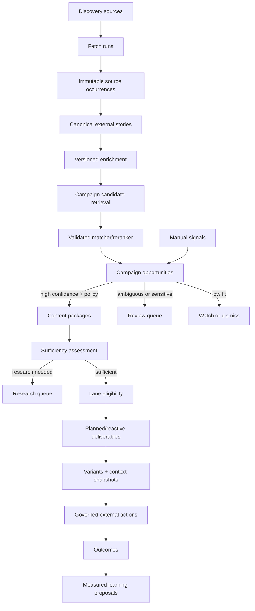

# Discovery Intelligence Infrastructure: Audit, Target Architecture, and Delivery Design

> **Status:** Approved design; implementation has not started  
> **Date:** 2026-07-22  
> **Decision owner:** Founder  
> **Chosen approach:** Campaign-opportunity control plane  
> **Autonomy decision:** High-confidence discoveries automatically create campaign packages and lane-specific deliverables. Publishing, sending, spending, and other external actions remain governed independently.
> **Code validation (2026-07-23):** Audit citations re-verified against `main`. Sprint 45 discovery routing is merged (commit `3bf2f1f`, migration `0032_same_scorpion`), so every finding below is against live code. The campaign-lane control plane this design routes into already exists (`campaign_lanes`, `campaign_lane_revisions` in `apps/api/src/db/schema.ts`), but discovery does not yet reach it — see §6.6.

## Executive Summary

Discovery is one of Tuezday's most important control-plane inputs. Its purpose is not to collect a list of links. Its purpose is to continuously find relevant external developments, understand why they matter to an organization, and turn the strongest opportunities into grounded work across that organization's active content pipelines.

The target organization may operate:

- 100 active content pipelines;
- 20 speaking personas;
- 5 active campaigns;
- 10 channels and multiple formats per channel; and
- thousands of posts, emails, assets, and other content objects.

The current discovery implementation is a capable founder-scale system. It has broad source coverage, connected-account seams, item ingestion, exact-ID deduplication, multi-candidate persona/campaign matching, triage, and downstream draft automation. It is not yet safe or structurally capable of operating the target workload.

The audit found release-blocking security, provider, data-loss, concurrency, and lifecycle failures. Even after those defects are repaired, scaling the current raw-item inbox and direct signal-to-draft fan-out would preserve the wrong operating model. The target must instead use this hierarchy:

```text
source occurrence
→ canonical external story
→ campaign opportunity
→ campaign-specific content package
→ sufficiency and lane eligibility
→ lane-specific deliverables
→ variants
→ governed external actions
→ outcomes
```

The central scaling rule is:

> **One stable campaign lane is one content pipeline. Discovery matches stories to a small set of campaign opportunities, not directly to all 100 lanes. Packages then fan out only to eligible lanes inside the selected campaign.**

This changes the recurring matching cost from `every story × every pipeline` to `every story × a few campaign candidates`, followed by controlled, capacity-aware fan-out.

The recommended delivery strategy is a safety-first strangler migration:

1. Repair security, tenant isolation, provider breakage, atomicity, and deletion lifecycle.
2. Replace synchronous polling with a lossless, bounded, leased task runtime.
3. Introduce immutable source occurrences and canonical stories.
4. Create versioned campaign opportunities and high-confidence automatic packages.
5. Evaluate package sufficiency and generate only eligible lane deliverables.
6. Run the new path in shadow, then cut over campaign-by-campaign.
7. Move to Postgres before horizontal multi-writer execution or high-availability requirements exceed a single database owner.

Discovery-dependent autonomous workflows are a production **no-go** until the release blockers in this document are resolved.

---

## 1. Product Contract

Discovery is Tuezday's continuous external-intelligence engine. It must:

1. Continuously observe external sources without silently missing bursts.
2. Preserve every source occurrence and its provenance.
3. Resolve multiple occurrences into a durable canonical story without destructive false merging.
4. Enrich the story with freshness, entities, topics, source trust, corroboration, and novelty.
5. Determine which current campaign plans could legitimately act on the story.
6. Propose a distinct supported angle for each matched campaign.
7. Automatically create packages only when fit, confidence, source trust, novelty, evidence sufficiency, and campaign capacity meet policy.
8. Fan a package only into active, compatible, capacity-eligible lanes.
9. Create idempotent deliverables and variants with complete source and context lineage.
10. Keep external authorization separate from discovery qualification and drafting autonomy.
11. Let humans operate by exception instead of manually triaging every fetched item.
12. Learn from decisions and downstream outcomes without silently rewriting routing policy.

### 1.1 What a pipeline means

A content pipeline is a stable `campaign_lane` with revision-scoped configuration. A lane already has or is designed to have:

- campaign and plan revision;
- speaking persona;
- target audience;
- channel and format;
- publishing connection and provider target;
- planned schedule and quantity;
- reactive period and cap;
- guidance and CTA/offer selection; and
- effective autonomy policy.

The theoretical cross-product of 20 personas × 5 campaigns × 10 channels is not itself the pipeline set. The active, intentionally configured lanes are the pipeline set.

### 1.2 Autonomy doctrine

- Source fetching, canonicalization, enrichment, campaign matching, package creation, research proposals, sufficiency assessment, lane eligibility, and variant generation may execute autonomously.
- A high-confidence match is permission to create internal work, not permission to publish.
- Publishing, sending, replying, launching spend, changing budget, and changing targeting remain external actions governed by resolved policy and guardrails.
- Human-required policy at any applicable scope wins.
- Manual discovery decisions always win for their stated scope and retain actor and reason.

### 1.3 Non-negotiable invariants

- One stable lane represents one continuing production pipeline.
- Raw observations never acquire observation×lane match edges.
- Discovered-content opportunities reference canonical stories directly. Existing `signals` remain the manual-input and legacy-compatibility seam, not the target discovery authority.
- A package belongs to exactly one campaign and plan revision, but may reference many source snapshots.
- One story may create several campaign opportunities with different angles.
- Dismissing an opportunity for Campaign A does not dismiss the same story for Campaign B.
- Every generated claim is supported by package sources or the package remains `research_needed`.
- One package creates at most one reactive deliverable per lane unless a user explicitly requests more.
- Planned-slot and reactive-cap assignment is transactional.
- Regeneration creates a new variant; it never overwrites historical lineage.
- Published and sent history is immutable.
- Source archival never destroys canonical stories, packages, or output provenance.
- Configuration changes stale or re-evaluate only affected uncommitted work.
- Every background handler is bounded, leased, idempotent, observable, and restart-safe.
- JSON stores snapshots and provider payloads, not fields required for joins, filtering, capacity enforcement, or uniqueness.

---

## 2. Audit Scope and Verification

The audit traced the full discovery path:

```text
contracts
→ source/tracked-account routes
→ keyless and connected adapters
→ source job ledger
→ discovered-item persistence
→ cross-source deduplication
→ LLM matching
→ accept/skip triage
→ signal matches
→ automation
→ worker scheduling
→ web UI and priorities
```

It covered:

- contracts and cross-field validation;
- workspace and reference authorization;
- adapter behavior and current provider requirements;
- SSRF, timeouts, response bounds, and parsing;
- cursor, pagination, retry, and backoff behavior;
- job claiming, stale recovery, overlap, and fairness;
- canonicalization and source-deletion lifecycle;
- matching, invalidation, triage, and signal creation;
- downstream automation and idempotency;
- worker startup and environment configuration;
- UI error handling, refresh, navigation, and scaling; and
- migrations, tests, and operational observability.

Verification performed during the audit:

- Discovery-focused suites: **206/206 tests passed**.
- Repository type checking: all workspaces passed.
- Production build: passed.
- Full test run: **1,519/1,520 tests passed inside the sandbox**. The single failure was Chromium being denied a macOS Mach port; its complete 14-test file passed **14/14** outside the sandbox.
- Focused read-only probes reproduced tenant-reference leakage, orphan signal creation, private feed URL acceptance, canonical deletion damage, source PATCH status drift, URL hash collision, oversized multi-handle fan-out, LinkedIn self-target fallback, and score/accept concurrency drift.

The green suites do not contradict the findings. Existing tests primarily use immediate, happy-path fixtures and do not cover current provider expiry, hostile URLs, cross-workspace references, migrations from historical data, deletion after cross-source deduplication, slow/hung dependencies, concurrent triage/scoring, worker startup, or real cursor progression.

---

## 3. Current Strengths Worth Preserving

The replacement should evolve—not discard—the strongest current seams:

- Workspace-level authentication and ordinary source/connection ownership validation are consistently applied.
- Source adapters have injected fetch/fabric seams that are straightforward to test.
- Provider failures are isolated per source rather than aborting the whole run.
- Exact same-source external IDs have a database uniqueness guarantee.
- Exact HTTP 429 receives source-local exponential backoff.
- Nango proxy requests have a 30-second per-call timeout.
- Match parsing clamps scores, caps candidates, and rejects model-returned IDs outside the supplied workspace context.
- Stable campaign, plan-revision, lane, and lane-revision models already exist in `apps/api/src/db/schema.ts`.
- Lane revisions already model persona, audience, channel, format, connection, schedule, planned quantity, and reactive capacity.
- The control-plane design already separates content production from external-action authorization.
- Existing resolver traces, external-action fingerprints, and connector receipts provide useful provenance and idempotency foundations.

---

## 4. Confirmed Release Blockers

### P1.1 Cross-workspace reference injection and non-atomic signal creation

`createSignalInputSchema` accepts arbitrary persona/campaign UUIDs. `createSignalWithMatching` trusts them and inserts a `signal_matches` row without verifying that either referenced object belongs to the signal workspace.

Evidence:

- `packages/contracts/src/index.ts:2133-2143`
- `apps/api/src/routes/signals.ts:28-41`
- `apps/api/src/services/signals.ts:25-72`
- `apps/api/src/services/matching.ts:213-230`

Reproduction:

- Direct access to another workspace's personas returned `403`.
- Creating a signal in the caller's workspace with the foreign persona UUID returned `201` and exposed the foreign persona's name.
- Creating a signal with a nonexistent but valid UUID returned `500` while leaving the signal row persisted.

Required correction:

- Resolve every supplied reference through workspace-scoped services before writing.
- Create the signal, explicit match, suggested projections, and response state in one transaction.
- Return `404` for unknown or foreign references without revealing which case occurred.
- Add composite or service-enforced tenant invariants for all cross-workspace reference paths.

### P1.2 Authenticated SSRF and unbounded keyless downloads

RSS and podcast `feedUrl` values receive syntactic URL validation only and are fetched directly. There is no protocol allowlist, private-network rejection, DNS/redirect revalidation, timeout, byte bound, content-type bound, or decompression limit.

Evidence:

- `packages/contracts/src/index.ts:2204-2206,2268-2285`
- `apps/api/src/discovery/adapters.ts:64-69,117-120,191-194`

Required correction:

- Introduce one shared safe-fetch service.
- Permit HTTPS by default; permit HTTP only through explicit operator policy.
- Reject embedded credentials, loopback, private, link-local, metadata, multicast, and unsafe IPv6 destinations.
- Resolve DNS and validate every redirect hop.
- Bound redirects, connect time, total time, body bytes, decompression ratio, and accepted MIME types.
- Stream into a byte-limited parser instead of unbounded `Response.text()`.
- Record a safe failure class without exposing internal response content.

### P1.3 LinkedIn discovery is currently non-operational and semantically unsafe

The adapter sends `LinkedIn-Version: 202506`, which LinkedIn sunset on 2026-06-15. Deprecated headers return errors. The adapter also discards ordinary competitor handles unless they are already author URNs; it falls back to `/v2/userinfo` and fetches the connected member's own posts. Organization reads require a scope that the current connection does not request.

Evidence:

- `apps/api/src/discovery/connected-adapters.ts:283-340`
- `apps/api/src/services/connections.ts:21-35`
- `packages/contracts/src/index.ts:2931-2946`
- [LinkedIn Marketing API changes](https://learn.microsoft.com/en-us/linkedin/marketing/integrations/recent-changes?view=li-lms-2026-01)
- [LinkedIn API versioning](https://learn.microsoft.com/en-us/linkedin/marketing/versioning?view=li-lms-2026-04)
- [LinkedIn Posts API permissions](https://learn.microsoft.com/en-us/linkedin/marketing/community-management/shares/posts-api?view=li-lms-2026-02)

Required correction:

- Disable LinkedIn discovery until a supported version and target-resolution flow are deployed.
- Make provider versions centrally configured, monitored, and covered by expiry alerts/canaries.
- Resolve handles to durable person/organization URNs before activating a source.
- Never fall back from an explicit competitor target to the connected self.
- Distinguish member and organization targets and validate scopes/roles before source activation.
- Parse the approval flag as a boolean; the string `false` must not enable a scope.

### P1.4 Google Trends calls a dead endpoint

The adapter calls `/trends/trendingsearches/daily/rss`, which currently returns HTTP 404. Google still documents RSS export on Trending Now, so this is endpoint drift.

Evidence:

- `apps/api/src/discovery/adapters.ts:196-201`
- [Google Trends: Trending Now](https://support.google.com/trends/answer/3076011?hl=en)

Required correction:

- Disable the source type until the current feed is integrated and verified.
- Replace path-string unit assertions with response-contract fixtures plus a scheduled live canary.
- Store a stable provider item ID or time-bounded story identity; title-only IDs must not suppress a recurring trend forever.

### P1.5 Instagram remains tied to the rejected legacy login architecture

HEAD still provisions Facebook Login and resolves an Instagram account through `/me/accounts`. The accepted Instagram Login design states that these permissions were rejected and requires the Instagram provider/API-host migration. The adapter also selects the first linked Instagram business account when several exist.

Evidence:

- `packages/contracts/src/index.ts:2965-2979`
- `apps/api/src/discovery/connected-adapters.ts:349-450`
- `docs/superpowers/specs/2026-07-19-instagram-login-threads-oauth-design.md:9-14,51-54`

Required correction:

- Finish Instagram Login migration before treating Instagram discovery as available.
- Bind each connection to one explicit Instagram account identity.
- Mark legacy Facebook Login rows as reconnect-required.
- Validate discovery permissions during source creation rather than failing only during scheduled work.

### P1.6 Automatic discovery has no reliable repository startup path

Root `npm run dev` starts API and web but not the worker. The API loads the root `.env`; the worker does not. With defaults the worker sends no bearer token and receives `401`. If the documented root `.env` is sourced externally, `TUEZDAY_API_URL` points to the web/MCP public API base rather than the internal API expected by the worker.

Evidence:

- `package.json:10-16`
- `apps/api/src/server.ts:9-23`
- `apps/worker/src/index.ts:4-22`
- `.env.example:68,90-92`

Required correction:

- Give the worker a distinct `TUEZDAY_INTERNAL_API_URL` or remove HTTP self-calls in favor of leased tasks.
- Load environment configuration consistently and validate it at startup.
- Fail fast outside test/development when credentials or URLs are invalid.
- Include the worker in the documented development and deployment process.
- Scope worker credentials to internal task endpoints rather than accepting a global system actor on ordinary protected routes.

### P1.7 The bounded job runner is not actually bounded or lease-safe

Five jobs are claimed and marked running upfront, then executed serially. Keyless fetches, worker calls, and some LLM calls are unbounded. A job older than ten minutes is marked stale globally, but the original execution continues. Completion/failure updates do not verify lease owner, attempt, or running state, so a stale worker can resurrect or overwrite state.

Multi-account sources magnify the problem: X may make approximately 102 sequential provider calls and return up to 1,275 items because the apparent 25-item limit is applied per handle rather than per source.

Evidence:

- `apps/api/src/services/discovery-jobs.ts:13-130`
- `apps/api/src/services/discovery.ts:680-821`
- `apps/api/src/discovery/connected-adapters.ts:56-75,179-198,434-447`
- `apps/api/src/connectors/nango.ts:200-243`

Required correction:

- Move fetch, canonicalize, enrich, match, package, fan-out, and generate into independently bounded tasks.
- Claim each task atomically with lease owner, lease version, and expiry.
- Fence heartbeat, success, retry, and failure updates by owner/version.
- Claim only work that can begin under current workspace/provider concurrency.
- Enforce source-global page, item, call, byte, and runtime budgets.
- Isolate failures per tracked account so one deleted/private handle does not discard other results.

### P1.8 Cursor and pagination support is inert

Cursor fields exist in contracts and storage but are not consumed or updated. Connected providers and keyless feeds retain only the first 25 items. Bursts exceeding the newest page can be lost permanently.

Evidence:

- `packages/contracts/src/index.ts:2235-2240`
- `apps/api/src/db/schema.ts:379-383`
- `apps/api/src/services/discovery.ts:69-84,768-777`
- `apps/api/src/discovery/connected-adapters.ts:114-116,168-208,239-264,324-339,426-445`
- [X pagination guidance](https://docs.x.com/x-api/posts/search/integrate/paginate)

Required correction:

- Persist provider-specific high-watermarks and pagination state.
- Fetch with overlap/replay until a known provider ID, cursor boundary, or explicit page/runtime cap.
- Commit observations and cursor advancement atomically.
- On crash or expired cursor, replay overlap instead of skipping forward.
- Treat a cursor checkpoint as a delivery guarantee, not display metadata.

### P1.9 Deleting a source can permanently hide surviving duplicates

Source deletion cascades its discovered items. `duplicateOfId` deliberately has no FK and deletion performs no re-canonicalization. A duplicate can survive while pointing to a deleted canonical row, remain invisible to triage, and continue being skipped by same-source external-ID deduplication.

Evidence:

- `apps/api/src/db/schema.ts:456-486`
- `apps/api/drizzle/0032_same_scorpion.sql:34-39`
- `apps/api/src/services/discovery.ts:293-296`

Required correction:

- Archive source configuration instead of hard-deleting historical observations.
- Separate immutable source occurrences from canonical stories.
- Snapshot source identity on the occurrence.
- Model fuzzy/semantic duplicate relationships as reversible cluster membership, not a destructive hidden status.
- Backfill and repair every existing dangling duplicate before cutover.

### P1.10 Scoring races triage and can strand accepted signals

Scoring selects `new` items, awaits the LLM, then updates by item ID without rechecking status. Acceptance copies whatever matches exist at that instant. A delayed score can update an already accepted item while the created signal retains no matches. Scoring failures leave an unscored item triageable, and acceptance then creates a permanently unrouted signal because accepted items are not rescored.

Evidence:

- `apps/api/src/services/discovery.ts:556-630`
- `apps/api/src/services/discovery.ts:426-453`
- `apps/api/src/services/automation.ts:330-346`

Required correction:

- Persist matching as a versioned task result keyed by canonical story fingerprint and campaign-profile fingerprint.
- Atomically transition an opportunity/package from a specific matcher result.
- Recheck expected state/version at commit.
- Never represent LLM failure as no relevance; use a visible retryable/error state.
- Do not allow auto-package creation until a validated matcher result exists.

### P1.11 Worker overlap can produce duplicate downstream work

Independent fire-and-forget interval callbacks overlap. Invalid, zero, negative, or nonnumeric intervals become near-continuous timers. Automation checks for an existing draft before asynchronous generation, but no database uniqueness constraint protects signal×campaign×channel output, so overlapping ticks can both generate.

Evidence:

- `apps/worker/src/index.ts:394-430`
- `apps/api/src/services/automation.ts:265-363`
- `apps/api/src/services/signal-drafting.ts:35`
- `apps/api/src/db/schema.ts:262`

Required correction:

- Replace independent orchestration intervals with task scheduling and atomic idempotency keys.
- Validate all timing configuration as finite positive bounded values.
- Make only one path authoritative for creating package, deliverable, variant, draft-adapter, and external-action records.
- Add database uniqueness at every exactly-once business boundary.

### P1.12 Source PATCH can create permanently invalid or inert sources

Create-time type/mode invariants live in `createDiscoverySourceInputSchema.superRefine`. PATCH accepts a generic partial config and does not validate the merged source or recompute status. Attaching a valid connection to a parked X source can leave it `needs_api_key` forever; removing required RSS config returns `200` and fails only during scheduled execution.

Evidence:

- `packages/contracts/src/index.ts:2259-2351`
- `apps/api/src/services/discovery.ts:270-290,694-700`

Required correction:

- Merge the stored source with the patch and parse it through the full discriminated source schema.
- Derive status from type, config, connection, provider capability, permission validation, and archival state.
- Reject unsupported modes at the API boundary.
- Recompute `nextRunAt` and enqueue/cancel appropriate tasks after a valid transition.

---

## 5. Additional Confirmed Defects

### P2 correctness and lifecycle

- URL normalization lowercases case-sensitive path/query data, causing false merges (`apps/api/src/services/discovery.ts:500-516`).
- Query parameters are not sorted and Google News publisher URLs are not unwrapped, causing false negatives.
- The dedup migration did not backfill historical URL/content hashes.
- Content similarity is treated as a destructive duplicate decision rather than a reversible candidate cluster.
- Duplicate external IDs within one provider response partially commit the first row and then mark the source/job failed (`apps/api/src/services/discovery.ts:716-766`).
- Persona deletion can remove match rows while leaving stale suggested IDs and no re-score trigger.
- The configuration watermark causes full-backlog re-score on some edits while missing plan, lane, guidance, and Brain changes.
- Accept, skip, match replacement, score update, and several job transitions are not atomic compare-and-swap operations.
- Ordinary failure writes `lastFetchedAt`, falsely reporting a successful fetch (`apps/api/src/services/discovery.ts:806-813`).

### P2 retry and provider behavior

- Only exact HTTP 429 receives backoff despite the design requirement for temporary 5xx backoff.
- Proxy response headers are discarded, preventing `Retry-After` or provider reset handling.
- Instagram classifies every HTTP 400 as a permission failure, including validation and throttling failures.
- A single malformed or inaccessible account aborts a multi-account source.
- Connected response bodies are timeout-bounded but not size-bounded.
- OAuth connection deduplication omits provider identity and can revive the wrong provider row when connection IDs collide.

### P2 scale and observability

- Discovery and signal reads are unpaginated and hydrate matches/drafts across the entire result set.
- Matching scores the whole eligible backlog serially after every run.
- Current automation repeatedly scans all historical signals for every automated campaign and channel.
- The job ledger has no retention policy or true queue-depth endpoint.
- Stale discovery-job cleanup is not workspace-scoped.
- A sequentially hung workspace delays every later workspace.
- Background generation errors can be counted as `skipped` without useful logs or operator alerts.
- Only accepted-item analytics exist; auto-route, dismiss, override, no-match, rescore, package, sufficiency, and lane fan-out decisions are not measurable.

### P2 operator experience

- The Discovery page loads only on mount/local actions; there is no focus refresh, polling, stream, or explicit refresh control.
- Several toggle, delete, and triage actions ignore `res.ok`, presenting server failure as a no-op.
- The UI can report a run as finished while jobs remain queued because `queued` means newly enqueued, not total backlog.
- Home's `Review signal` link points to `/discovery?signal=...`, but Discovery ignores that query and loads only new items.
- Source administration dominates the daily surface instead of campaign opportunities.
- Triage is one item at a time with no server pagination, grouping, assignment, scoped bulk action, preview, or recovery.
- Manual automation is attributed to the system actor instead of the requesting user.

### P3 lower-impact issues

- Atom prefers `updated` over `published`, which can make edited old entries appear new.
- Google Trends title fallback IDs can suppress a recurring trend indefinitely.
- Tracked-account resolution timestamps/errors have no writer.
- Tracked Reddit accounts are modeled but unused by source creation/fetching.
- Brain source suggestions remain limited to the original RSS, Google News, and Reddit types.
- Duplicate provenance expansion uses a click-only pseudo-button without keyboard activation.

---

## 6. Why the Current Shape Cannot Meet the Target

### 6.1 The current decision unit is wrong

The current UI and API treat a raw discovered item as the unit requiring action. At the target volume, operators should not decide whether a URL is globally useful. They should decide—usually by policy—whether a canonical story creates a useful opportunity for a specific campaign.

A single story may be:

- irrelevant to Campaign A;
- a category-validation angle for Campaign B;
- a founder lesson for an evergreen campaign; and
- too repetitive for Campaign C this week.

Global accept/skip cannot represent those independent decisions.

### 6.2 Direct lane matching creates an N×M explosion

With 100 active lanes and 5,000 canonical stories, scoring every story against every lane is already 500,000 story×lane decisions before channel generation or existence checks. It repeats on each polling cycle and grows with history.

The hierarchy avoids this:

1. Compile five campaign routing profiles when configuration changes.
2. Retrieve/rank at most a few candidate campaigns per story.
3. Create one package per accepted campaign angle.
4. Evaluate only that campaign's active lanes.
5. Enforce planned slots, compatibility, repetition, and reactive capacity transactionally.

### 6.3 A single relevance score cannot govern autonomy

Relevance, confidence, freshness, novelty, source trust, campaign fit, and evidence sufficiency answer different questions. A score of 80 may mean highly relevant but poorly supported, or trustworthy but already overused. These cases require different dispositions.

### 6.4 Synchronous request execution cannot provide lossless autonomy

Provider pagination, parsing, enrichment, matching, package creation, research, and generation have different timeouts, retry rules, concurrency limits, and failure classes. Running them in one HTTP request prevents fair scheduling, durable retries, accurate progress, and restart safety.

### 6.5 Destructive deduplication destroys intelligence

Multiple source occurrences are valuable corroboration. They may contain different headlines, excerpts, publication times, authors, or evidence. A canonical story should aggregate occurrences; it should not delete or permanently hide them.

### 6.6 Discovery's judgment never reaches the lane model today

This is the structural gap the whole design closes, and it must be stated plainly because two generations of the model coexist in `main`:

- **The lane/control-plane path already exists.** `campaign_lanes` and `campaign_lane_revisions` bind campaign, plan revision, persona, audience, channel, format, publishing connection, provider target, schedule, planned quantity, delivery mode, and reactive cap. It is reached by the external-action pipeline (`external_actions.laneRevisionId`, priorities, dispatch) — the pipeline unit this design needs is not hypothetical.
- **Discovery feeds a different, lane-unaware path.** Accepting a discovered item creates a `signal` and copies its `discovered_item_matches` into `signal_matches` (`apps/api/src/services/discovery.ts:426-454`). `runAutomation` then routes each signal on `signal_matches` and fans out over the campaign's legacy `channelsJson`, generating one draft per channel with no knowledge of lanes (`apps/api/src/services/automation.ts:296-359`).

So discovery today routes on campaign + channel + persona and stops at a lane-unaware draft; its judgment never flows into the lane revisions that model the actual production pipeline. The target does not invent the pipeline unit — it rewires discovery onto the one that exists: story → campaign opportunity → package → eligible lane revision → deliverable → governed external action. This is why the migration retires `channelsJson`/`personaIdsJson`/`posting_cadences` as planning authorities (Section 15) instead of adding a parallel routing path.

---

## 7. Chosen Target Architecture



### 7.1 Component boundaries

#### Source registry and scheduler

Owns source configuration, target identity, connection, cadence/priority, capability state, last success/attempt, next run, cursor health, backoff, and source cost/yield metrics.

It does not own canonical stories or delete historical observations.

#### Safe fetch and provider adapters

Owns outbound safety, provider pagination, per-call limits, raw response validation, and conversion to normalized source occurrences.

Adapters return occurrences plus a checkpoint proposal. They do not mutate cursors themselves.

#### Source occurrences

An immutable record of what one source exposed at one time. It stores the provider ID, source snapshot, title, URL, excerpt/content fingerprint, author, provider publication time, observed time, and raw metadata within a size limit.

#### Canonical external story

A workspace-owned durable intelligence object independent of any one source. Exact normalized URL/provider IDs provide strong identity. Content similarity produces reversible cluster candidates with confidence and evidence, not destructive hiding.

#### Manual signal and legacy compatibility bridge

Today `signals` are the single convergence point for discovery. Accepting a discovered item creates a signal and copies its matches into `signal_matches` (`apps/api/src/services/discovery.ts:426-454`); manual founder input is created the same way; and `runAutomation` routes every signal — discovered or manual — off `signal_matches`. The target narrows the signal to what only a human can originate: it keeps `signals` as the manual-input trigger and removes them from the discovered-content path. Discovered-content opportunities reference `canonical_external_stories` directly, with no intervening signal.

Exactly one trigger is set on an opportunity, enforced by a database/service XOR invariant that requires one and forbids both:

- `canonicalStoryId` for discovered external content — no signal is created; or
- `manualSignalId` for a founder/operator-created signal.

During migration only, an auto-qualified opportunity may emit one idempotent compatibility signal so legacy draft/automation consumers keep working while a campaign is still on the old path. That derived signal is a sink, never a source: it carries no `canonicalStoryId`/`manualSignalId` and is never re-read as an opportunity trigger, so the two directions cannot loop or double-create. It is retired once package/deliverable execution is authoritative for that campaign. Human-created manual signals remain first-class opportunity triggers after the derived-signal bridge is removed.

#### Enrichment

Versioned output keyed by story fingerprint and enricher version. It may include language, full-text extraction, entities, topics, source trust, corroboration count, freshness/expiry, novelty, prior-package similarity, and safety flags.

#### Campaign routing profile

A compiled, versioned projection of an active campaign plan:

- objective and KPI;
- audiences;
- pillars/topics;
- offers and CTAs;
- timeframe and current urgency;
- personas represented by active lanes;
- formats and channels represented by active lanes;
- planned/reactive fulfillment gaps;
- exclusions, sensitive topics, and routing policy; and
- profile fingerprint.

The profile is derived data. The plan revision and lane revisions remain the authority.

#### Campaign opportunity

An immutable matcher decision for one story/signal, campaign, plan revision, and proposed angle. It stores separate score dimensions, confidence, reason, supported claims, expiry, suggested speaking persona, matcher version, routing-policy result, and lifecycle.

Suggested persona at this stage is a recommendation; the lane revision remains the final execution authority.

#### Content package

A campaign-specific, source-grounded narrative unit. It records the chosen angle, plan revision, typed sources, sufficiency state, repetition assessment, and coordinated deliverables.

#### Sufficiency and lane eligibility

Sufficiency decides which claims and formats are supportable. Lane eligibility then evaluates active lane revision, persona, audience, channel, format, account health, planned slots, reactive cap, recent repetition, media requirements, and policy.

#### Deliverables and variants

A deliverable is one campaign commitment for one lane and time. A variant is one candidate execution. Every variant retains a replayable context snapshot and never overwrites a prior candidate.

#### External action and outcome

The existing external-action control plane remains the only boundary for work leaving Tuezday. Outcomes link back to the exact variant, deliverable, package, opportunity, story, and source occurrences.

---

## 8. Proposed Domain Model

Names below describe responsibilities. Exact migration DDL belongs in the implementation plan.

### 8.1 `discovery_source_occurrences`

Purpose: immutable provider/source observations.

Important fields:

- `id`, `workspaceId`, `sourceId`, `fetchRunId`
- `providerExternalId`
- source identity snapshot
- title, observed URL, excerpt, bounded raw metadata
- provider-published time and observed time
- normalized URL key and content fingerprint
- parsing/enrichment state

Uniqueness:

```text
(source_id, provider_external_id)
```

### 8.2 `canonical_external_stories`

Purpose: durable workspace intelligence independent of source lifecycle.

Important fields:

- identity/status/fingerprint
- canonical URL and title
- first/last observed timestamps
- freshness/expiry
- current enrichment version
- archive/watch state

Exact-key uniqueness should use a child identity table when several keys can identify one story:

```text
(workspace_id, key_kind, key_hash)
```

### 8.3 `story_occurrences`

Purpose: reversible membership linking occurrences to canonical stories.

Important fields:

- story and occurrence IDs
- relationship kind: `exact | redirect | provider | similarity | manual`
- confidence and matcher version
- actor/reason for manual changes

### 8.4 `story_enrichments`

Purpose: immutable/versioned enrichment output.

Uniqueness:

```text
(story_id, story_fingerprint, enricher_version)
```

### 8.5 `campaign_routing_profiles`

Purpose: compiled candidate-retrieval/matching context for one active plan revision.

Uniqueness:

```text
(campaign_id, plan_revision_id, profile_fingerprint)
```

### 8.6 `campaign_opportunities`

Purpose: independent story×campaign×angle decisions.

Suggested lifecycle:

```text
candidate
→ auto_qualified | needs_review | watchlisted | dismissed
→ package_created | expired | superseded
```

Important trigger fields:

- nullable `canonicalStoryId`;
- nullable `manualSignalId`; and
- a database/service XOR invariant requiring exactly one.

Uniqueness uses separate partial boundaries:

```text
(canonical_story_id, campaign_id, plan_revision_id, angle_hash, matcher_version)
  where canonical_story_id is not null

(manual_signal_id, campaign_id, plan_revision_id, angle_hash, matcher_version)
  where manual_signal_id is not null
```

### 8.7 `content_packages` and `package_sources`

Package sources use explicit roles:

- `trigger`
- `evidence`
- `inspiration`
- `instruction`
- `repurposed_from`

Source snapshots survive later mutation or deletion.

### 8.8 `sufficiency_assessments` and `lane_eligibility_decisions`

Sufficiency stores supported claims, missing facts/media, eligible/ineligible formats, confidence, and research actions. Lane eligibility stores the exact lane revision and every allow/block reason.

### 8.9 Channel and format registry

The current contract has fewer channel values than the target scenario, while lane `format` is a free string. The foundation therefore needs one registry that defines:

- channel and format identity;
- supported persona/audience/account requirements;
- generation task and deterministic constraints;
- required media/evidence;
- preview/renderer behavior;
- external-action kind and adapter;
- supported outcome metrics; and
- active/deprecated capability state.

A channel/format is not considered operational merely because it appears in an enum. It is supported only when lane validation, generation, preflight, intentional dispatch/export, status, and outcome behavior are registered and tested.

### 8.10 `deliverables`, `variants`, and `context_snapshots`

Planned uniqueness:

```text
(lane_revision_id, original_scheduled_for)
```

Reactive uniqueness:

```text
(package_id, lane_revision_id)
```

Context snapshots retain plan/lane/persona/account/Brain/guidance/source/model inputs required for replay and audit.

### 8.11 `orchestration_tasks` and `task_attempts`

The task ledger stores:

- task kind and entity reference;
- workspace, priority, and idempotency key;
- `queued | running | succeeded | retryable | dead | cancelled`;
- available time, lease owner/version/expiry;
- attempt count and structured failure class;
- correlation ID and timestamps.

Attempts are append-only. Business blocks such as insufficient evidence are domain state, not retryable infrastructure errors.

Task/action uniqueness:

```text
(workspace_id, idempotency_key)
```

---

## 9. Matching and Routing Design

### 9.1 Stage 1: deterministic campaign candidate retrieval

When a story fingerprint or campaign profile changes:

1. Build a query from story title, excerpt/full text, entities, topics, freshness, and novelty.
2. Retrieve active campaign profiles using deterministic lexical/BM25 and structured overlap signals.
3. Apply hard exclusions and timeframe/status filters.
4. Retain at most a small candidate set—normally three campaigns.

At five campaigns, evaluating all active profiles is inexpensive. The explicit candidate-retrieval boundary prevents future growth from pushing every lane or campaign into every LLM prompt.

### 9.2 Stage 2: validated matcher/reranker

The model receives only:

- the canonical story and enrichment;
- candidate campaign profiles;
- required output schema; and
- untrusted-content delimiters/instructions.

It returns, per campaign candidate:

- campaign fit;
- confidence;
- proposed angle;
- supported claims and supporting occurrence IDs;
- suggested speaking persona;
- freshness/expiry;
- actionability; and
- a bounded reason.

Returned IDs must be validated against the candidate set. Parse failure, timeout, or invalid evidence becomes a retryable/invalid matcher result, never `not relevant`.

### 9.3 Separate score dimensions

The system must retain and display:

- **Workspace relevance:** Does this matter to the organization at all?
- **Campaign fit:** Does it support the active plan's objective, audience, pillar, offer, or timing?
- **Confidence:** How likely is the judgment to be correct?
- **Freshness/expiry:** How quickly does the opportunity decay?
- **Novelty/repetition:** Has the campaign recently used this story or angle?
- **Source trust/corroboration:** How reliable and independently supported is it?
- **Actionability/sufficiency:** Can it support a distinct package without invention?
- **Operational priority:** Fit plus urgency, fulfillment gap, and confidence.

A composite sort score may exist as a transparent projection. It must not replace the dimensions or become the only policy input.

### 9.4 Routing policy bands

Each campaign routing profile supports:

```text
off | review | auto_package
```

It also defines minimum fit/confidence/trust, sensitive-topic review rules, daily package cap, reactive period cap, novelty window, and permitted source classes.

Disposition:

- **Auto-package:** high fit and confidence, trusted/corroborated source, sufficient supported angle, no sensitive-topic rule, acceptable novelty, and available campaign/lane capacity.
- **Needs review:** medium confidence, sensitive topic, uncertain attribution, possible repetition, or policy-requested sample review.
- **Research needed:** strong opportunity but insufficient evidence or required media.
- **Watch/dismiss:** low fit, expired, duplicate angle, or policy exclusion.

The quality target—not an arbitrary raw threshold—is at least 95% precision for auto-qualified opportunities on the approved labeled set.

### 9.5 Package and lane fan-out

After package creation:

1. Evaluate sufficiency for the proposed angle and formats represented by current lanes.
2. Prefer filling the oldest compatible planned deliverables/slots.
3. Evaluate reactive lanes only when no planned commitment is appropriate or the lane explicitly supports reactive delivery.
4. Enforce lane period caps and campaign package caps transactionally.
5. Prevent a package from generating the same angle for the same lane twice.
6. Queue one generation task per deliverable.

Raw discovery never decides the final channel format prematurely.

---

## 10. Durable Runtime and Fairness

### 10.1 Task decomposition

Initial task kinds:

- `source.fetch`
- `occurrence.canonicalize`
- `story.enrich`
- `story.match_campaigns`
- `opportunity.auto_disposition`
- `package.assess_sufficiency`
- `package.fan_out`
- `deliverable.generate_variant`
- `variant.propose_action`
- `action.dispatch`
- `outcome.collect`
- `dependency.evaluate_staleness`

### 10.2 Claiming and leases

- Claim atomically by status, availability, and lease expiry.
- Store owner, lease version, and expiry.
- Heartbeat and finalization require matching owner/version.
- A stale worker cannot complete a task after another worker has reclaimed it.
- Provider calls use task/entity idempotency keys where supported.
- Domain inserts use database uniqueness even when task delivery repeats.

### 10.3 Backpressure and fairness

- Concurrency limits exist per workspace, provider, task kind, and model.
- A single workspace cannot occupy more than 25% of worker slots while another workspace has ready work.
- Tasks have explicit page, call, byte, token, and runtime budgets.
- Retry uses bounded exponential backoff with jitter and provider reset hints.
- Poison tasks become `dead` with operator action rather than retrying forever.
- Manual `Run now` enqueues work and returns `202`; it does not execute the entire graph inline.

### 10.4 Storage strategy

SQLite WAL can support the foundation with one bounded database owner and atomic compare-and-set claims. Move to Postgres before:

- multiple API/worker processes write concurrently;
- horizontal task workers are required;
- high availability becomes a production requirement;
- sustained write contention exceeds the scale gate; or
- operational restore/RPO requirements cannot be met reliably.

The preferred migration is a verified maintenance-window cutover, not application dual-write.

---

## 11. Operator Experience

Discovery becomes an exception-management and intelligence surface.

### 11.1 Overview

Shows:

- qualified opportunities today;
- auto-qualified versus reviewed volume;
- review backlog and oldest age;
- campaign opportunity and fulfillment gaps;
- packages blocked on sufficiency/research;
- source freshness and permission failures;
- task queue depth, oldest ready task, and dead tasks; and
- source-to-package/outcome contribution.

### 11.2 Opportunities — default daily view

Canonical stories are grouped with expandable campaign opportunities. Filters include:

- campaign and plan revision;
- suggested persona;
- eligible lane/channel/format;
- source/source class;
- age and expiry;
- fit/confidence/trust bands;
- owner and state;
- auto/review/manual disposition; and
- text/entity/topic search.

Campaign-scoped actions include qualify, dismiss, watch, snooze, change angle, request research, and create package. A decision for one campaign never silently applies to another.

### 11.3 Sources

Shows:

- connection and target identity;
- source cadence/priority;
- last attempt, last success, and next attempt;
- cursor/high-watermark lag;
- backoff/quota and actionable permission state;
- unique-story yield;
- qualified-opportunity yield;
- package/output/outcome contribution; and
- archival impact.

### 11.4 Decision detail

Shows occurrences/corroboration, canonicalization evidence, match dimensions, proposed angle, plan/profile/matcher/policy versions, supported claims, repetition result, sufficiency, eligible/ineligible lanes, and full audit history.

### 11.5 Bulk operation safety

Bulk actions support server-side scope, dry-run preview, idempotent application, per-item results, actor/reason, and undo where the domain state remains reversible. The UI must distinguish:

- this campaign opportunity;
- every opportunity for this canonical story; and
- a saved query/policy update.

---

## 12. Measurement and Learning

### 12.1 Required decision events

Emit structured events for:

- source fetch success/failure/page/cursor;
- occurrence stored;
- story created/merged/unmerged;
- enrichment completed/invalid;
- campaign candidate selected/rejected;
- opportunity auto-qualified/reviewed/dismissed/overridden/expired;
- package created/research-needed/blocked;
- lane eligible/ineligible and cap reason;
- deliverable created/staled/cancelled;
- variant generated/selected/rejected;
- action proposed/authorized/dispatched/failed; and
- outcome collected.

Each event includes workspace, correlation ID, relevant graph IDs, actor, previous/new state, reason, model/prompt/policy version where applicable, and timestamp.

### 12.2 Product quality metrics

- Campaign-opportunity precision and recall.
- Auto-routing precision and manual overturn rate.
- False-negative rate from weekly labeled sampling.
- Percentage requiring human review and decisions per operator/day.
- Source unique-story yield and qualified-opportunity yield.
- Time from provider publication → observation → opportunity → package → deliverable.
- Research-needed and insufficiency rates.
- Package-to-output conversion.
- Repetition/cap block rates.
- Source/campaign/angle contribution to downstream outcomes.

### 12.3 Learning policy

Outcomes and human decisions may propose threshold, source, or profile changes. They do not silently change routing policy. Every policy/model promotion requires a labeled backtest and explicit version change.

---

## 13. Service-Level Objectives and Scale Gates

Reference fixture:

- 100 active lanes;
- 20 personas;
- 5 active campaigns;
- 10 channel types;
- 250 discovery sources;
- 100,000 historical occurrences;
- 10,000 open opportunities;
- 5,000 historical outputs; and
- burst of 1,000 observations plus 2,000 generation tasks.

| Area | Foundation target |
| --- | --- |
| Due-source scheduling | At least 99% start within 5 minutes |
| Standard-source freshness | p95 provider publication → stored occurrence within 30 minutes |
| High-priority freshness | p95 within 10 minutes |
| Judgment latency | p95 canonical story → durable disposition within 5 minutes; p99 within 15 minutes when dependencies are healthy |
| Observation retention | 100% in deterministic burst/cursor/restart tests; at least 99.9% monitored in production |
| Routing recall | At least 90% on an approved labeled set of at least 300 representative stories |
| Auto-package precision | At least 95%; manual overturn rate below 5% |
| Invalid routing | Zero opportunities to inactive campaigns; zero deliverables to inactive/incompatible lanes |
| Idempotency | Zero duplicate opportunity/package/deliverable/variant/action records or external side effects under retry/restart tests |
| Sufficiency | Zero insufficient packages reaching generation |
| Capacity | Zero reactive-cap or planned-slot uniqueness violations |
| Human load | At most 10% of canonical stories require review and no more than 20 manual decisions per operator/day under the reference distribution |
| API performance | p95 paginated/filter response below 2 seconds; page size capped at 100 |
| Enqueue performance | p95 below 250 ms |
| Bulk decisions | Preview and apply 1,000 scoped decisions idempotently within 10 seconds |
| Config invalidation | Only affected uncommitted work marked stale/re-evaluated within 5 minutes |
| Explainability | 100% retain sources, dimensions, reason, plan/profile/matcher/policy version, and actor |
| Lineage | 100% of generated/published outputs trace to variant, deliverable, package, opportunity, story, and occurrences |
| Fairness | No workspace consumes over 25% of worker slots while another has ready work |
| Retry recovery | At least 99.5% of retryable tasks recover; dead tasks below 0.5% over 24 hours |
| Scale gate | 2× target load for 60 minutes plus 24-hour target soak without growing backlog |

---

## 14. Phased Delivery Roadmap

### Phase 0 — Release brakes, access boundaries, and recoverability

Goal: make unsafe or costly behavior controllable before deeper migration.

Deliverables:

- Feature switches for discovery ingestion, LLM work, task claiming, auto-package creation, auto-generation, and external actions.
- Worker credentials restricted to internal task endpoints.
- Fail-fast environment validation.
- Role policy for source mutation, costly manual runs, routing policy, and external authorization.
- Correlation IDs, redacted structured logs, operational metrics, and audit events.
- Verified SQLite online backup, off-host copy, checksum, restore tooling, and pre-migration backup gate.

Exit gate:

- Credential-scope tests pass.
- Kill switches are exercised.
- Restore drill demonstrates RPO ≤5 minutes and RTO ≤30 minutes.
- Security-sensitive operations are attributable.

### Phase 1 — Security, provider availability, and atomic lifecycle

Goal: eliminate known release blockers without changing the product model.

Deliverables:

- Safe fetcher and SSRF matrix.
- Tenant-scoped signal references and transactions.
- Atomic/idempotent accept, skip, match replacement, and job state transitions.
- Source archival and duplicate repair.
- Full PATCH validation/status derivation.
- Supported Google Trends path or disabled capability.
- Supported LinkedIn version/target resolver or disabled capability.
- Instagram Login migration or disabled capability.
- Provider canaries and expiry monitoring.

Exit gate:

- No SSRF/authz bypass in the adversarial suite.
- Fault injection leaves each transaction wholly old or wholly new.
- Source archival preserves accepted-signal provenance.
- Provider availability claims are backed by live canaries.

### Phase 2 — Lossless bounded runtime

Goal: remove synchronous discovery work and guarantee lossless cursor progression.

Deliverables:

- `orchestration_tasks` and append-only attempts.
- Bounded source fetch and canonicalization tasks.
- Cursor/high-watermark progression with overlap/replay.
- Per-workspace/provider fairness and quotas.
- Retry/dead classification and operator recovery.
- Keyset pagination and hot-path indexes.
- Queue depth, oldest age, cursor lag, and dead-task views.

Exit gate:

- A >25-item burst loses nothing.
- Crash immediately before/after checkpoint causes no gap.
- Restart/retry creates no duplicate occurrence or task side effect.
- Reference backlog drains under provider throttling and tenant contention.

### Phase 3 — Canonical stories and campaign opportunities in shadow

Goal: replace raw-item judgment with canonical intelligence and campaign-scoped decisions.

Deliverables:

- Immutable source occurrences and canonical story graph.
- Exact identity plus reversible similarity clusters.
- Versioned enrichment.
- Campaign routing profiles.
- Deterministic campaign retrieval and validated matcher.
- Versioned campaign opportunities and policy bands.
- Server-paginated Opportunities UI in shadow mode.
- Labeled 300+ story evaluation set and promotion harness.

Exit gate:

- Exact dedup fixtures have 100% recall and no false merges.
- Campaign-opportunity recall ≥90%.
- Auto-qualified precision ≥95% before enabling auto-package.
- No LLM error is stored as irrelevant/no-match.

### Phase 4 — Packages, sufficiency, and lane deliverables

Goal: automatically turn qualified opportunities into bounded, grounded internal work.

Deliverables:

- Content packages and typed package sources.
- Sufficiency/research-needed lifecycle.
- Format registry with channel compatibility and requirements.
- Lane eligibility decisions.
- Idempotent planned-slot filling and reactive fan-out.
- Deliverables, variants, and context snapshots.
- One-way adapter creating at most one legacy draft while the old UI remains in use.

Exit gate:

- High-confidence opportunity automatically creates the correct campaign package.
- Insufficient packages never generate.
- Only active compatible lanes receive deliverables.
- Reactive caps and planned-slot uniqueness hold under concurrency.
- Every variant has complete replayable provenance.

### Phase 5 — Campaign-level canary and cutover

Goal: make the new graph authoritative without dual creation.

Rollout state:

```text
legacy | shadow | active | paused
```

Feature controls:

- `discovery_ingest_v2`
- `orchestration_tasks_v2`
- `campaign_opportunities_v1`
- `package_pipeline_v1`
- `auto_package_creation`
- `auto_variant_generation`
- `control_plane_execution`

Rollout:

1. Internal workspace.
2. One low-risk campaign.
3. 5% of eligible campaigns.
4. 25%.
5. 100% after gates hold.

Exit gate:

- Zero critical shadow mismatches for seven days or three complete schedule cycles.
- Noncritical mismatches below 0.1% and explained.
- External authorization cannot be bypassed.
- Kill-switch and restart drills pass.
- Legacy direct automation no longer creates records for active campaigns.

### Phase 6 — Storage, worker scale, and retention

Goal: scale execution after correctness is proven.

Deliverables:

- Verified Postgres migration when a trigger is met.
- Multi-worker claims using `FOR UPDATE SKIP LOCKED`.
- Queue-age autoscaling.
- Retention/partitioning for attempts/events/old occurrences.
- Immutable retention for provenance, published output, actions, and outcomes.

Exit gate:

- Production-like migration counts/checksums/FKs/indexes agree.
- 2× target load passes for one hour.
- Target load runs 24 hours without backlog growth.
- DB p99 writes remain below 100 ms under the scale fixture.

---

## 15. Migration Strategy

The migration is additive and reversible by campaign:

1. Add new occurrence/story/task tables without changing current discovery behavior.
2. Archive rather than delete source rows; snapshot source identity for historical items.
3. Backfill current `discovered_items` into occurrences and canonical stories. Ambiguous clusters remain separate and flagged rather than guessed.
4. Seed campaign opportunities from useful `discovered_item_matches` and `signal_matches` as a one-time backfill: each match's `campaignId` selects the opportunity's campaign, the accepted item maps to its canonical story, and model score/reason are preserved where available. This backfill reads the old matches; it does not re-drive legacy automation.
5. Add campaign routing profiles for active plan revisions.
6. Run new opportunity decisions in shadow and compare with current matches/manual outcomes.
7. Add packages/deliverables/variants and one-way compatibility writes to existing drafts.
8. Activate one campaign at a time; stop legacy automation creation for that campaign.
9. Retire `suggestedPersonaId`/`suggestedCampaignId` as authorities; retain them only as cached projections during transition.
10. Retire the discovered-item→signal accept path (`acceptDiscoveredItem`) and direct signal-to-draft automation (`runAutomation` over `channelsJson`), along with `campaigns.channelsJson/personaIdsJson` as planning authorities, after lane-backed reads/writes are accepted. Human-created manual signals remain as an opportunity trigger.
11. Retire `posting_cadences` as a separate planning authority once lane-backed external actions own dispatch.

Rollback pauses new V2 intake and drains/reconciles nonterminal work. It does not blindly re-enable legacy creation, which could duplicate already-created packages, deliverables, or actions.

---

## 16. Testing Strategy

### 16.1 Security

- Private/metadata IPv4 and IPv6 destinations.
- DNS rebinding and public→private redirects.
- Embedded credentials and unsafe protocols.
- Oversized, chunked, compressed, slow, and non-feed responses.
- XML bombs and malformed structures.
- Cross-workspace reference IDs on every source/match/signal/package path.
- Worker credential attempts against ordinary user/admin endpoints.

### 16.2 Atomicity and concurrency

- Fault injection after every accept, match, cursor, lease, package, capacity, and action write.
- Concurrent accept/skip/score.
- Concurrent task claims and stale-lease recovery.
- Concurrent planned-slot and reactive-cap assignment.
- Restart during fetch, checkpoint, match, fan-out, generation, and dispatch.
- Exactly one opportunity/package/deliverable/variant/action under repeated delivery.

### 16.3 Pagination and provider resilience

- More than one provider page.
- Overlap/replay around the last known ID.
- Expired/invalid cursor.
- Mid-page 429 and 5xx with reset hints.
- One invalid account among many.
- Current live-provider canaries isolated from deterministic unit suites.

### 16.4 Routing quality

- Minimum 300-story labeled evaluation set spanning campaigns, personas, sources, ambiguous/no-match cases, sensitive topics, repetitions, and expiring opportunities.
- Candidate retrieval recall measured separately from LLM reranking.
- Auto-package precision and manual overturn.
- Prompt-injection fixtures from untrusted source content.
- Model/prompt/profile-version regression comparison before promotion.

### 16.5 Package/lane behavior

- One story creates independent opportunities for several campaigns.
- Dismissing one opportunity leaves others unchanged.
- One campaign opportunity creates one package angle.
- Insufficiency creates research work and blocks generation.
- Planned slots are preferred correctly.
- Reactive caps and novelty windows prevent content explosion.
- Channel/format/media incompatibility produces explainable lane blocks.
- Plan/persona/guidance changes stale only affected unpublished work.

### 16.6 Scale and soak

- Reference fixture from Section 13.
- Four workers after Postgres cutover.
- 1,000-observation and 2,000-generation burst.
- Provider throttle, LLM slowdown, worker crash, and database restart.
- One-hour 2× load and 24-hour target soak.
- Verify queue drains, fairness holds, p95/p99 SLOs hold, and no lineage gaps appear.

---

## 17. Immediate Recommended Actions

Before implementing the target model:

1. Feature-flag LinkedIn, Google Trends, and legacy Instagram discovery as unavailable until their provider paths pass current canaries.
2. Block unsafe feed destinations and add total fetch limits.
3. Add workspace-scoped validation and transactions to manual signal creation.
4. Stop source hard deletion; archive sources and repair dangling duplicates.
5. Prevent acceptance of unscored/invalid matcher results and fence score commits by state/version.
6. Fix source PATCH merged validation and status derivation.
7. Validate worker environment/timers and stop overlapping discovery/automation loops.
8. Add source-global caps and timeouts before permitting multi-account sources at scale.
9. Add cursor progression before claiming lossless connected discovery.
10. Establish the labeled routing set and decision-event instrumentation before enabling automatic package creation.

These actions create a safe base for the opportunity/package migration; they are not a substitute for that migration.

---

## 18. Explicit Non-Goals for the Foundation

The foundation does not require:

- a general-purpose visual workflow builder;
- direct story-to-100-lane matching;
- autonomous source discovery/pruning;
- embeddings or a knowledge graph before lexical candidate recall is measured;
- trend prediction or cross-campaign portfolio optimization;
- causal attribution presented as fact;
- silent outcome-trained policy changes;
- replacing the Brain/resolver, connector fabric, or external-action boundary; or
- external queue infrastructure before a database task ledger proves insufficient.

The schema boundaries deliberately permit later semantic clustering, story evolution, adaptive polling, learned ranking, package portfolio optimization, and richer attribution without replacing the foundation.

---

## 19. Foundation Acceptance Scenario

The discovery infrastructure is ready for the target operating model when this scenario passes:

1. Seed 100 active lanes across 20 personas, 5 campaigns, and 10 channel types, plus 100,000 occurrences and 5,000 historical outputs.
2. Ingest three occurrences of the same external development from different sources.
3. Produce one canonical story with three preserved provenance records.
4. Create three independent campaign opportunities with distinct supported angles.
5. Auto-qualify the high-confidence opportunities, route an ambiguous one to review, and retain/dismiss a low-fit one according to policy.
6. Automatically create campaign packages only for qualified opportunities with sufficient evidence and available capacity.
7. Fill compatible planned slots first, then create bounded reactive deliverables for eligible lanes.
8. Generate lane-specific variants with exact plan, persona, account, Brain, source, model, and policy snapshots.
9. Require external authorization wherever resolved policy demands it.
10. Restart workers during fetch, match, fan-out, generation, and dispatch without losing work or creating duplicates.
11. Archive a source and preserve every story, package, output, and outcome link.
12. Change a plan/persona/guidance rule and stale only affected unpublished work.
13. Trace every published outcome back to its exact variant, deliverable, package, opportunity, story, and source occurrences.
14. Meet every quality, latency, fairness, idempotency, lineage, and soak gate in Section 13.

---

## 20. Final Decision

Tuezday should not invest in making the current raw-item inbox merely larger. It should preserve the existing adapter and campaign-lane foundations while changing the unit of intelligence and work:

> **Observe occurrences once, understand canonical stories once, make independent campaign decisions, create grounded campaign packages automatically at high confidence, and fan them into only the lanes that are eligible and have capacity.**

That is the architecture capable of supporting 100 content pipelines and thousands of outputs without producing uncontrolled fan-out, silent data loss, opaque judgment, or untraceable automation.
