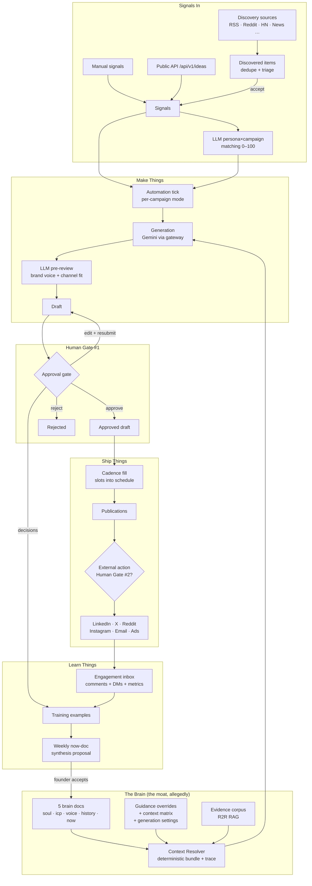
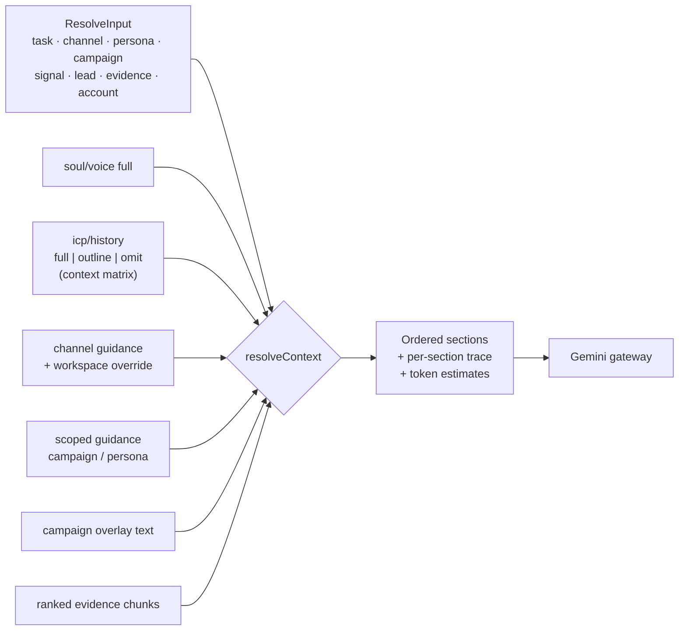
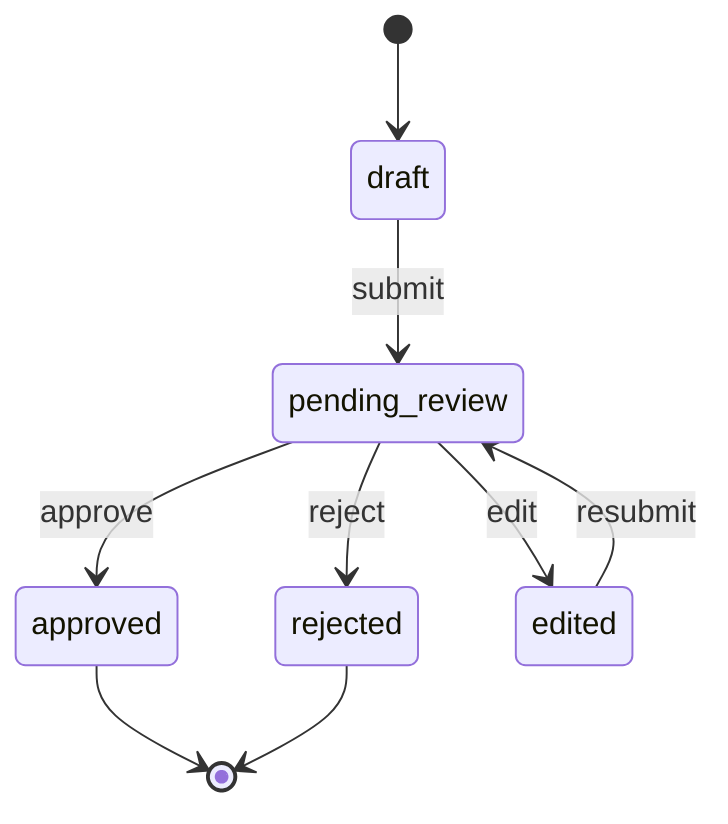
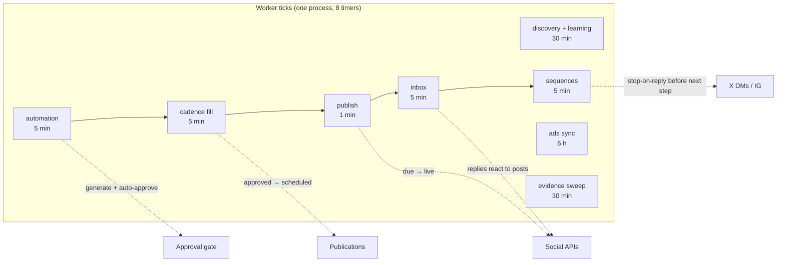
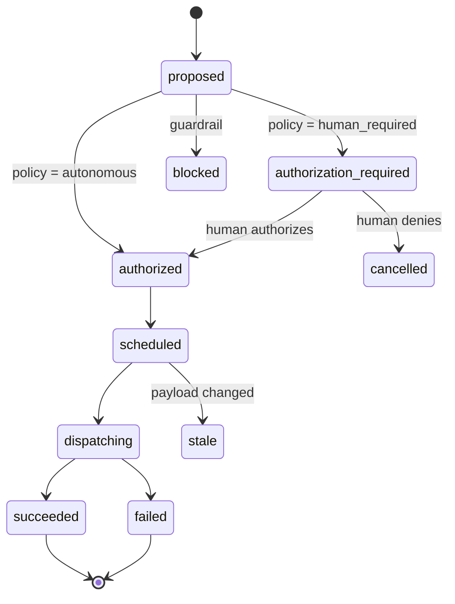

# Tuezday: What's Actually Built (An Honest Atlas)

> **What this is.** A code-verified inventory of every feature on `main` as of 2026-07-23 — what it's for, how it's actually wired, and where the bodies are buried. Everything below was read out of `apps/api/src`, `apps/web/app`, `apps/worker`, `apps/mcp`, and `packages/*` — **not** out of the planning docs, which have a charming habit of describing things that don't exist yet.
>
> **What this is not.** A review of the 7 unmerged branches sitting in `.worktrees/` (UI revamp × 5, campaign creative engine, Instagram/Threads OAuth). Those are Schrödinger's features — designed, some partially coded, not on `main`. This doc audits `main` only.
>
> **How to read it.** Each section: *why it exists → what it actually does → how it's built → verdict*. The conflicts section at the end is the part you actually came for.

---

## 0. The Machine, In One Picture

Before the tour, here's the whole factory floor. Yes, it's a lot. That's rather the point of this document.

The flywheel: signals come in, the brain shapes generation, a human approves, robots ship it, engagement flows back, the brain updates. That loop **does exist end-to-end in code** — which is genuinely impressive — with caveats catalogued below.

---

## 1. Foundation: Auth, Workspaces, Teams, Onboarding

**Need:** Multi-tenant SaaS table stakes. Someone has to own the workspace before the AI can ghost-write their personality.

**What's built:**

- **Auth** (`services/auth.ts`, `auth/guard.ts`) — email/password (scrypt-style hashing) *and* Google OAuth (`upsertGoogleUser`, web callback page at `/login/google/callback`). Session tokens in a `sessions` table. One global Fastify `preHandler` guards every route except `/auth/register`, `/auth/login`, `/health`. A bearer token resolves to either a session user or the **system actor** (worker token) which bypasses workspace membership checks.
- **Workspaces** (`services/workspaces.ts`) — CRUD plus an `onboardingStep` cursor and a per-workspace analytics opt-out (PostHog sink is injectable, `createAnalyticsSink()`).
- **Teams** (`services/teams.ts`) — roles are just `owner`/`member`, invites via emailed token links (`/invites/[token]` page), last-owner protection, `claimIfMemberless`.
- **Onboarding** (`apps/web/app/onboarding/`) — a real 7-step flow: `name → website → connect → verify → brain → campaign → draft`. It scrapes your website (`services/scrape.ts` — a `stripHtml` special, no headless browser), LLM-extracts a **brand profile** (`brand-profile.ts`, statuses `scraping → extracting → ready/failed`), optionally reads your **social corpus** through a connected account, then **auto-drafts all five brain docs** (`brain-autodraft.ts`), has you verify/edit, creates a first campaign, and produces a first draft. The `next-action` service knows the autodraft actor label (`system:onboarding`) so it can tell whether a human has ever actually touched the brain.

**Verdict:** Solid and boring in the best way. The onboarding is a genuine product feature, not a form wizard — it front-loads the brain so the first draft isn't garbage.

---

## 2. The Central Brain & Context Resolver

**Need:** The entire pitch of Tuezday. Every module resolves context through one deterministic, inspectable pipeline instead of vibes-based prompt concatenation.

**What's built:**

- **Five brain docs** per workspace (`soul`, `icp`, `voice`, `history`, `now`), each **versioned** (`brainDocumentVersions` with actor attribution), editable in the web UI (`/brain`), exportable as one markdown file. Completeness scoring lives in `packages/brain` (`scoreDoc` / `scoreBrain`, a doc is "complete" at 40+ words — an optimistic bar, but it's a bar).
- **Outlines** — each doc can be parsed into sections (`parseDocSections`) with LLM-generated per-section summaries (`enrichOutlineSummaries`) and a non-LLM fallback (`buildFallbackOutline`). This exists so long docs can be injected as *outlines* instead of full text.
- **The resolver** (`packages/brain/src/resolver.ts`) — `resolveContext(input)` takes workspace + task type + channel + persona + campaign + optional signal/conversation/lead/media-contact/account/evidence and returns an **ordered list of context sections, each with a trace** explaining why it's there and roughly how many tokens it costs (`estimateTokens`). Task instructions for all 16 task types are hard-coded here (`TASK_INSTRUCTIONS`), including composed variants (PR pitch types, follow-ups, ad creative formats, review instructions).
- **Selective context / "zoom"** (`zoom.ts`) — keyword-scored section ranking (`rankSections`) so only relevant sections of big docs get packed. Pure lexical scoring, no embeddings. Honest and cheap.
- **Layered customization knobs** (see conflict #4 later, because there are… several):
  - **Channel guidance** — built-in per-channel text in contracts, workspace-level overrides in `guidanceOverrides`, plus *scoped* guidance (campaign/persona scopes).
  - **Context matrix** (`context-matrix.ts`) — per task type, choose `full` / `outline` / `omit` for the `icp` and `history` docs only (`MATRIX_DOC_TYPES`).
  - **Generation settings** (`generation-settings.ts`) — workspace-level generation defaults.
- **Resolver inspector UI** (`/resolver`) — you can see exactly what would be packed before any LLM call. The "readable before any LLM call" rule is actually honored.

**Verdict:** This is the most faithfully-built part of the platform relative to the vision. The resolver is deterministic, traced, and genuinely the single funnel — grep confirms every generation path goes through it.

---

## 3. Generation → Approval Gate → Conversational Editor

**Need:** LLM output must never touch the outside world without a human (or an explicitly-configured robot) saying yes.

**What's built:**

- **Sandbox generation** (`POST /workspaces/:id/generate`, `/sandbox` UI) — resolve context, call the LLM gateway (Gemini 2.5 Flash, provider-agnostic interface, `GatewayError` taxonomy), store the generation **with its full context trace** (`generations` table). There's also an **angles** endpoint (`/angles`) that generates N distinct angle options before committing to a draft.
- **LLM pre-review** (`services/review.ts`) — after generating, a second LLM pass scores the output on `brand_voice` and `channel_fit`, parsed into a score + issue list, stored on both generations and drafts. Violations surface in the UI (e.g. ad creative sets show `withViolations`).
- **Ratings** — every generation can be rated `accepted` / `needs_edit` / `rejected`; these are the learning loop's raw food.
- **The approval gate** (`services/drafts.ts`) — the canonical state machine from contracts (`transitionTo`/`canTransition`, states `draft → pending_review → approved | rejected | edited`, actions `submit/edit/resubmit/approve/reject`), every decision logged in `approvalDecisions` with actor attribution. Media can be attached to drafts. **One-click email approvals** exist via signed `approvalActionTokens` (the mailer sends "approve/reject" links).
- **The conversational editor** (`services/draft-editor.ts` + `draft-revisions.ts`, `/review` UI) — chat-style revision of a draft: each turn is persisted (`draftRevisionTurns`, `running → completed | failed`), guarded against concurrent revisions (`RevisionInProgressError`) and mid-flight draft edits (`DraftChangedError`), with normalized context sections so the editor knows what the original generation saw.
- **The unified Review workspace** (`/review?tab=approvals|authorizations|inbox`) — approvals queue, external-action authorizations queue, and the engagement inbox as sibling tabs. The old `/approvals` and `/inbox` routes are proper redirects, not zombie pages. Good hygiene.

**Verdict:** Built as designed, arguably *over*-built (pre-review + human review + ratings + revision turns is four opinions per paragraph). But it's coherent, and the decision log is real.

---

## 4. Campaigns & The Campaign Control Plane

**Need:** Content needs a "why". Campaigns are the organizing container for goals, and (later sprints) a structured plan for what gets produced.

**What's built — and note there are two layers here:**

1. **Campaigns v1** (`services/campaigns.ts`) — name, origin (`user`/`system`), purpose (`initiative`/`evergreen`), status (`draft/active/paused/completed/archived`), an **automation mode** (`manual` / `human_in_the_loop` / `scheduled_auto`) that drives the automation tick, and a free-text **overlay** that `composeCampaignOverlay` injects into resolved context.
2. **The control plane** (`campaign-plans.ts` + `campaign-lanes.ts` + `orchestration-backfill.ts`) — versioned **plan revisions** (`draft → active → superseded`) holding objective, KPI, timeframe, audience IDs, pillars, offers, CTAs, and guidance; plus **lanes** (channel workstreams) with their own revisions, statuses (`active/paused/retired`) and delivery modes (`planned` / `reactive` / `planned_and_reactive` with per-day/week/month reactive caps). A backfill service migrates old campaigns into the control plane and reports `needs_configuration`.

The campaign workspace UI (`/campaigns/[campaignId]`) has tabs for overview, plan form + history, lanes, channels, results, and per-campaign action policy.

**Verdict:** Functional, but you now have **two places a campaign's "strategy" lives** — the free-text overlay (feeds the resolver) and the structured plan (feeds the UI and lane governance). Nothing in the resolver reads pillars/offers/CTAs from the active plan revision. See conflict #6.

---

## 5. Discovery Infrastructure

**Need:** Tuezday should hear the market so you don't have to doom-scroll professionally.

**What's built:**

- **Sources** — 14 registered types in contracts; **8 fetch live with zero credentials** via public feeds (`discovery/adapters.ts`): `rss`, `google_news`, `reddit` (public JSON), `hacker_news` (Algolia), `youtube` (channel RSS), `podcast` (RSS), `google_trends` (RSS), `funding_news`. Three more (`x`, `linkedin`, `instagram`) go live **through connected social accounts** (`connected-adapters.ts`) with per-provider modes (query, account_timeline, list_timeline, subreddit, hashtag). `g2`, `capterra`, and `intent` are **registered signage only** — `intent` is wired to a `NullIntentProvider` that does nothing, politely.
- **Tracked social accounts** (`tracked-social-accounts.ts`) — watch specific handles across x/linkedin/instagram/reddit with handle normalization.
- **A real job queue** (`discovery-jobs.ts`) — per-run batching (5 jobs), 10-minute claim locks, stale-lock release, per-source rate-limit backoff (5→60 min exponential). Driven by the worker's 30-min tick calling `POST /discovery/run` per workspace. So: a queue, but cranked by a polling loop — a bicycle with a jet engine bolted to a shopping cart, and honestly it works fine at this scale.
- **Dedupe** — URL hash + title/summary content hash; cross-source copies get status `duplicate` linked to the canonical item and never hit triage.
- **Triage** — items are `new → accepted | skipped`; accepting mints a **signal** carrying its match suggestions along.
- **LLM matching** (`services/matching.ts`) — every discovered item/signal is scored against persona×campaign pairs (0–100, keep top 5, default routing threshold 50, workspace-overridable). The prompt includes a brain digest; matches store a per-candidate reason.

**Verdict:** The most infrastructure-dense module. The live/inert split is the thing to be honest about in demos: 8 of 14 source types work today without keys, 3 need a connected account, 3 are decorative.

---

## 6. Signals

**Need:** The atomic unit of "something happened worth responding to". Three doors in: manual entry, discovery accept, public API (`/api/v1/ideas` — yes, ideas are just signals wearing a trench coat).

**What's built:** `signals` carry content (≤10k chars), a source enum, optional URL, **two generations of campaign-mapping metadata** (Sprint 31's `suggestedPersonaId`/`suggestedCampaignId` and Sprint 45's `matches[]` array — see conflict #3), and drafting: `POST` a channel + optional persona/campaign/token budget/evidence toggle and get a `signal_response` draft through the standard pipeline.

---

## 7. Evidence / RAG

**Need:** Ground generation in facts you actually said, not facts the model hallucinates you said.

**What's built:** An `EvidenceStore` interface with an **R2R-backed implementation** (per-workspace collections, `backfillCollections` migration). Documents have statuses (`processing/ready/failed`) and kinds (`manual`, `signal`, `published`). Retrieval (`retrieveEvidence`) composes a query from the resolve context and **re-ranks chunks with a recency-aware scorer** (`rankEvidenceChunks`) — Tuezday owns retrieval policy, R2R just stores vectors, exactly per the integration boundary. The clever bit: an **evidence candidates sweep** (worker, every 30 min) proposes your own signals and published posts as corpus additions, and *nothing enters the corpus until the founder accepts it*. Founder-gated RAG hygiene. Chef's kiss.

---

## 8. Learning Loop

**Need:** Approval decisions and engagement outcomes should compound into the `now` doc instead of evaporating.

**What's built:** Training examples derived from approval decisions + ratings (`listTrainingExamples`), manually-entered engagement metrics (`engagementMetrics`), and **now-doc synthesis** (`synthesizeNow`): an LLM proposal summarizing what worked, stored as `proposed → accepted | dismissed`. Accepting writes a new `now` version. The worker proposes weekly (default 7 days) only when no proposal is open. There's a 409 for "nothing to learn yet", which is the API equivalent of a participation trophy.

**Verdict:** The loop is real but thin — it learns from *decisions* and *manual metrics*; captured publication metrics (Section 9) feed the inbox UI more than the synthesis.

---

## 9. Scheduling, Publishing & the Engagement Inbox

**Need:** Approved content should ship itself on a rhythm, and replies shouldn't rot.

**What's built:**

- **Posting cadences** (`cadences.ts`) — per-channel schedules (weekday/time slots, 14-day horizon). A worker tick (5 min) **fills** each active cadence's upcoming slots with eligible approved drafts, creating `publications`.
- **Publications** (`publications.ts`) — `scheduled → published | failed`; a 1-minute worker tick fires due ones through the connector adapter for the routed connection. Live posts store external IDs/URLs.
- **Persona→account routing** (`persona-social-accounts.ts`) — map personas to specific connected social accounts per channel so the right identity posts.
- **Social connectors** — real adapters for **Reddit, LinkedIn, X, Instagram** (`connectors/social/*`) behind the `ConnectorFabric` (Nango) seam.
- **Automation** (`automation.ts`) — the 5-min tick that turns fresh matched signals into channel drafts per campaign automation mode: `human_in_the_loop` queues at the gate, `scheduled_auto` auto-approves so cadence fill can slot them. Guardrails: per-day post caps per connection and per campaign, plus a workspace master switch (`socialAutomationSettings`).
- **Engagement inbox** (`inbox.ts`) — polls comments/DMs on live posts, captures publication metrics (24h/7d windows), and can **generate + auto-post replies** (`engagement_reply` task) for `scheduled_auto` campaigns, with reply guardrails. Human-mode replies queue in the Review workspace.
- **Calendar** (`calendar.ts`, `/calendar`) — one merged view of planned/scheduled/completed work.

The tick ordering is deliberate and documented in-code: automation → fill → publish → inbox → sequences, so a signal can progress a full step per cycle and a detected reply stops a DM chain before the next follow-up fires. Someone thought about this. 

**Verdict:** This is a complete autonomous publish loop. Which means the *governance* on it (Section 12) is load-bearing, not decorative.

---

## 10. Outbound, Launches & CRM

**Need:** Lead-driven 1:1 GTM, as opposed to broadcast content.

**What's built:**

- **Leads** — CRUD + CSV import, per-lead `outbound_email` drafts through the approval gate.
- **Audiences / Lists** (`audiences.ts`, `/lists`) — `static` or `dynamic` (rule-based) segments over leads/contacts, attachable to campaigns.
- **Launches / Sequences** (`launches.ts`, `launch-sequences.ts`, `/launches`) — a targeted push per campaign across channels `email`, `x_dm`, `instagram_post`: generate per-recipient messages, then **multi-step follow-up sequences** with day offsets, per-connection daily DM caps, **stop-on-reply**, auto-send under `scheduled_auto`, and a completion detector. Email steps can be **exported as CSV for Smartlead/Instantly** (`CsvOutboundExporter`) *or* sent natively (see Section 11 and conflict #1).
- **CRM** (`crm.ts`, Freshsales connector via Nango) — contact sync with filters, discard/restore, import-contact-as-lead, push-lead-to-CRM. Tuezday is not a CRM, and mercifully, it still isn't.
- **PR** (`media-contacts.ts`, `pr.ts`) — media contacts (journalist/publication/podcast) + CSV import, pitch generation (`pr_pitch` with announcement/thought-leadership/reactive framing, plus `press_boilerplate`), and native pitch sending through the governed email path.

---

## 11. The Governed Email Stack (yes, you built one)

**Need:** Per the plan — you weren't going to. Per the code — you did.

**What's built:** A full native sending pipeline on Resend: **workspace sender domains with verification lifecycle** (`email-senders.ts`), **recipient permission states** (`unknown/allowed/suppressed`) + suppression list + workspace safety settings enforced by `checkEmailRecipientSafety` before any send, **delivery records** with status/origin tracking, and **signature-verified Resend webhooks** ingesting bounce/delivery events. Launch sequences, outbound drafts, and PR pitches all send through it as governed external actions.

**Verdict:** It's *well* built — safety-first, suppression-aware, verified-webhook-fed. It is also a direct contradiction of the "never build deliverability infra, use Smartlead/Instantly" boundary that still sits in CLAUDE.md, while the CSV exporter for those very tools still ships in the same codebase. Pick a lane. (Conflict #1.)

---

## 12. External Action Governance (Human Gate #2)

**Need:** Once robots can post, DM, email, and spend money, "approved the draft" is no longer the same question as "authorized the send".

**What's built:** The newest and chunkiest subsystem (`external-action-*.ts`, seven services):

- Every side-effect on the outside world is an **external action** of kind `publish` / `send` / `reply` / `paid_launch` / `budget_change` / `targeting_change`, flowing through a 10-state lifecycle with **idempotency keys and canonical payload fingerprints** (so a retried send can't double-fire, and a changed payload is detected as `stale`).
- A **policy tree** — rules (`inherit` / `autonomous` / `human_required`) at five scopes (`workspace → campaign → persona → connection → lane`) resolved to an effective policy per action. Backfilled for existing workspaces at boot. Editable per campaign, per persona/connection, with a "tightening" editor in `/automation`.
- A **coordinator/runtime** with per-kind adapters (publication, inbox reply, launch message, ad launch, ad mutation, email delivery) injected at the composition root — so Reddit posts and Meta budget changes go through the *same* authorize/dispatch machinery.
- **Authorization batches** — bulk-approve selected actions or a whole campaign's pending set, with per-item statuses.
- **Decision log, successor linking, stale detection**, and a projection service (`priorities`) feeding Home.

**Verdict:** Architecturally the most mature thing in the repo. But it means a single LinkedIn post can now require **two human approvals** (draft approval, then send authorization) unless policy says `autonomous` — see conflict #2.

---

## 13. Ads

**Need:** Paid is a channel; the brain should write the creative and the platform should gate the spend.

**What's built — three distinct layers, which is worth noticing:**

1. **Reporting** (`ads.ts`) — Meta ad account import via Nango, metric sync every 6h (re-pulling a window because Meta restates conversions), a **CSV import fallback** for the Nango-less, daily/campaign reports, and linking ad campaigns to Tuezday campaigns for blended results.
2. **Creative** (`ad-creatives.ts`, `angles.ts`) — `meta_ad_creative` and `google_rsa` variant sets generated through the resolver, parsed into structured variants, pre-review violations surfaced. Plus **rendered ad images** (`ad-images.ts`) via the design layer.
3. **Launch & spend** (`ad-launches.ts`) — ad launches with their **own** state machine and decision log (`submit/approve/reject/revise/launch`), objectives (traffic/awareness), targeting persistence, and **spend guardrails** tied to plan entitlements (`adSpendCapCents`, free tier = $0 cap, so the free plan's ad budget is a philosophical concept). Budget and targeting *mutations* on live ad sets route through external actions with Meta adapters.

**Verdict:** Works, but ads governance is split across the ad-launch state machine *and* external actions (conflict #5).

---

## 14. Design Layer (Carousels & Rendered Images)

**Need:** Instagram carousels don't write themselves; more importantly, they don't *render* themselves.

**What's built:** Workspace **design systems** with defaults, **scoped design overlays**, and cached **design templates** authored by a self-hosted **Open Design daemon** (`design/open-design.ts` — bearer-authed, internal-network-only, one throwaway authoring chat per template, BYOK LLM credential, never in the per-post hot path). Runtime rendering happens locally: `splitIntoSlides` chops an approved draft into slides, a **Playwright-based renderer** (`design/render.ts`, one shared headless browser per process) turns HTML templates into images, and an S3-compatible store publishes the assets. `instagram_carousel` is explicitly a *rendered* task type — never text-generated.

**Verdict:** Surprisingly production-shaped for a "Sprint 41" feature. The Playwright-in-API-process renderer is the scaling landmine to remember.

---

## 15. Home, Priorities & Insights

**What's built:**

- **Priorities** (`priorities.ts`) — Home's ranked to-do feed across 9 kinds: execution failures, stale actions, policy blocks, authorizations, content review, signal triage, learning review, connection health, campaign risk.
- **Next-action** (`next-action.ts`) — a *separate* checklist/guide-dot engine (`nextActionFor` in contracts) deriving onboarding-ish state: pending drafts, blocked publications (scheduled against disconnected accounts), contentless campaigns, has-a-human-touched-the-brain. Two ranking brains for one Home page (conflict #7).
- **Insights** (`insights.ts`, `/insights`) — native campaign + workspace roll-ups (approval rates, channel performance, ad metric totals) with CSV export. Distinct from PostHog product analytics (opt-out-able), publication metrics, engagement metrics, and ad metrics — four metric stores, no unified model yet (conflict #8).
- **Notifications** (`notifications.ts`) — channels per workspace (email + Telegram-style webhooks), draft-pending nudges with one-click approve tokens.
- **Activity & webhooks** (`events.ts`, `/activity`) — internal event log with delivery tracking to customer-registered **outbound webhooks**.

---

## 16. Platform Surface: Billing, Public API, MCP, Worker

- **Billing** — `free` / `pro` ($, 5 seats, 10 connectors, 1k gens/mo, $500 ad cap) / `scale` (unlimited), enforced by `entitlements.ts` (`assertWithinLimit`), Stripe checkout + verified webhooks, usage meters in `/billing`.
- **Public API** (`/api/v1/*`) — API keys with 5 scopes (`ideas:write`, `drafts:read`, `drafts:write`, `analytics:read`, `campaigns:launch`); endpoints for submitting ideas, listing/approving/rejecting pending drafts, launching campaigns, reading insights. Hashed keys, per-key scope checks.
- **MCP server** (`apps/mcp`) — six tools mirroring the public API: `submit-idea`, `list-drafts`, `approve-draft`, `reject-draft`, `launch-campaign`, `fetch-insights`. Your customers' Claude can approve their drafts. We live in the future.
- **Worker** (`apps/worker`) — one Node process, 8 `setInterval` loops, zero DB access, everything over HTTP as the system actor. Serial per-workspace iteration. Fine today; a queue when you have 500 workspaces.

---

## 17. Conflicts, Tensions & Things That Will Bite You

The part you asked for. Ranked roughly by "how much a directional decision is needed".

### 1. 🔴 You built the sending infra you swore not to build
CLAUDE.md (and the OSS-boundaries table) says: *"Outbound sending: Smartlead/Instantly — never build deliverability/warmup infra."* Meanwhile `main` contains: native Resend sending, sender-domain verification, suppression lists, recipient permission states, delivery-event webhooks — **and** the Smartlead/Instantly CSV exporter still wired into launches as the alternate path. Two contradictory outbound strategies coexist in one codebase, and the same is true for X DMs (native multi-step sequences with caps and stop-on-reply — that *is* sending infra). Either the boundary rule is dead (update the docs, own the email stack, eventually kill the CSV path) or the native path was scope creep (unlikely given how well-built it is). **Decide, then delete one.**

### 2. 🟠 The double human gate
A post in `human_required` policy needs draft approval (Gate 1) *and* send authorization (Gate 2). The two gates answer genuinely different questions ("is this good?" vs "may this leave the building?"), but by default a solo founder clicks yes twice per post. The policy tree can collapse this (approve draft → autonomous send), but nothing currently links "I just approved this draft" to "…and obviously authorize its publication". A one-click "approve & authorize" or an auto-authorize-on-approve default for publish actions would remove 50% of the clicking without weakening governance where it matters (spend, DMs, email).

### 3. 🟡 Two generations of signal→campaign mapping, both live
Signals carry Sprint 31's `suggestedPersonaId`/`suggestedCampaignId` **and** Sprint 45's scored `matches[]`. The automation path uses match scores + threshold; the older suggested-fields still ride along and pre-fill UIs. Same concept, two schemas, subtle divergence risk (a signal whose top match disagrees with its `suggested*` fields). Fold the old fields into "top match" and retire them.

### 4. 🟡 Context-customization knob sprawl
Count the ways generation context can be tuned: (1) brain doc edits, (2) built-in channel guidance, (3) workspace channel-guidance overrides, (4) *scoped* guidance (campaign/persona), (5) the context matrix (per-task icp/history modes), (6) generation settings, (7) campaign overlay text, (8) selective-context zoom, (9) design overlays for rendered output. Each is individually reasonable; together, the only place their interaction is visible is the resolver trace. That's a support-ticket generator and an audit priority — the resolver inspector UI is your friend here, make sure it shows *all nine*.

### 5. 🟡 Ads governance is split-brained
Ad launches have their own bespoke state machine + decision log; budget/targeting mutations on the same objects flow through external actions; and reporting sync is a third, independent layer. External actions were clearly the later, better idea — ad launches predate them and were partially retrofitted (`paid_launch` is an external-action kind, yet `adLaunchDecisions` still exists). Long-term: one governance spine.

### 6. 🟡 Campaign strategy lives in two places
The free-text campaign overlay feeds the resolver; the structured plan revisions (objective/KPI/pillars/offers/CTAs) feed the UI and lanes. **The resolver does not read the active plan.** So the thing the LLM sees and the thing the founder curates in the plan form can drift apart silently. Either resolve plans into context or be explicit that the overlay is the only LLM-visible field.

### 7. 🟢 Two ranking engines for Home
`priorities` (ops queue) and `next-action` (setup/guide state) both decide "what should you look at". They coexist peacefully today, but they're two codepaths computing overlapping answers from the same tables.

### 8. 🟢 Four metric stores, no unified model
`engagementMetrics` (manual), `publicationMetrics` (captured), `adCampaignMetrics` (synced), plus insights aggregating on the fly. The plan says "Tuezday owns the metric model" — currently Tuezday owns four metric models.

### 9. 🟢 Vocabulary shipped ahead of features
`DELIVERABLE_PRODUCTION_STATUSES` (11 states!) and `PACKAGE_SOURCE_ROLES` exist in contracts and are used by **nothing** in `apps/api` or `apps/web` — they belong to the campaign-creative-engine work still living in a worktree. Similarly, discovery types `g2`, `capterra`, `intent` are registered but inert (intent = `NullIntentProvider`). Not bugs — but anyone reading contracts will believe more exists than does. Flag them or comment them as "reserved".

### 10. 🟢 Operational footnotes
- The worker is 8 timers in one process doing serial per-workspace HTTP loops — correct until it isn't.
- The Playwright renderer shares one headless browser inside the API process — memory profile worth watching.
- SQLite (WAL) still under everything; the Postgres swap remains theoretical. Fine, but every new JSON-column habit makes the swap pricier.

---

## 18. Suggested Audit Order

Since you're about to review each segment's functionality, an order that front-loads decision-relevant findings:

1. **Outbound email + sequences** (conflict #1 — a directional decision changes what you'd even audit)
2. **External action policies + the double gate** (conflict #2 — defines the daily operating feel)
3. **Resolver + the nine knobs** (conflict #4 — correctness of the moat)
4. **Discovery** (live vs inert sources; matching quality)
5. **Automation → cadence → publish → inbox loop** (the autonomous path end-to-end)
6. **Campaign control plane vs overlay** (conflict #6)
7. **Ads** (three layers)
8. Everything else (brain editing, evidence, learning, PR, CRM, billing, API/MCP) — mature and lower-risk.

---

*Generated from code on `main` @ `03329c4`, 2026-07-23. If the planning docs disagree with this document, the planning docs are wrong — that's the whole point.*
