# Tuezday Greenfield Rebuild Plan

> Date: 2026-06-09
>
> Purpose: Define the order for rebuilding Tuezday from scratch as small, testable product slices. Each slice should be built, verified automatically, tested manually by the founder, and accepted before the next slice begins.

---

## Recommendation Up Front

Build the Central Brain first.

Do not start with content pipelines, outbound, CRM, ads, or discovery. Those modules only matter if they can ask a reliable brain what the company believes, who it sells to, how it speaks, what is true right now, and what evidence supports the action.

The first product slice should be:

> Create a workspace, fill the five brain docs, add one persona overlay, add one campaign overlay, resolve the final brain context, and generate a preview output from that resolved context.

That proves the moat before any execution plumbing exists.

---

## Rebuild Philosophy

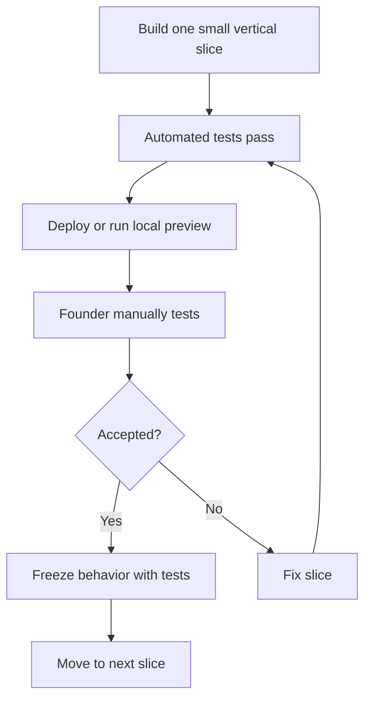

Rules:

1. Every slice must produce something visible or testable by a human.
2. Every slice must add automated tests before implementation.
3. No module can depend on a fake brain contract.
4. No integration gets added until the native boundary it plugs into exists.
5. No "platform breadth" work until one module proves the full loop.

---

## What We Are Rebuilding

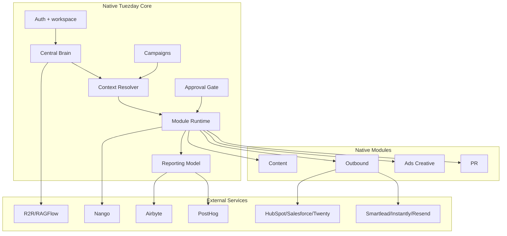

---

## Product Dependency Order

```mermaid
flowchart LR
    S0[Greenfield shell] --> S1[Central Brain v0]
    S1 --> S2[Context Resolver]
    S2 --> S3[Generation Sandbox]
    S3 --> S4[Approval Gate]
    S4 --> S5[Content Slice]
    S5 --> S6[Campaigns]
    S6 --> S7[RAG Corpus]
    S7 --> S8[Signal Discovery]
    S8 --> S9[Learning Loop]
    S9 --> S10[Outbound Slice]
    S10 --> S11[Connector Fabric]
    S11 --> S12[CRM/Ads/Lifecycle Integrations]
```

The first revenue/demo proof is not all of GTM. It is:

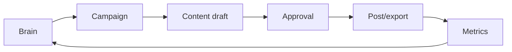

---

## Why Central Brain Comes First

Starting with content creates this risk:

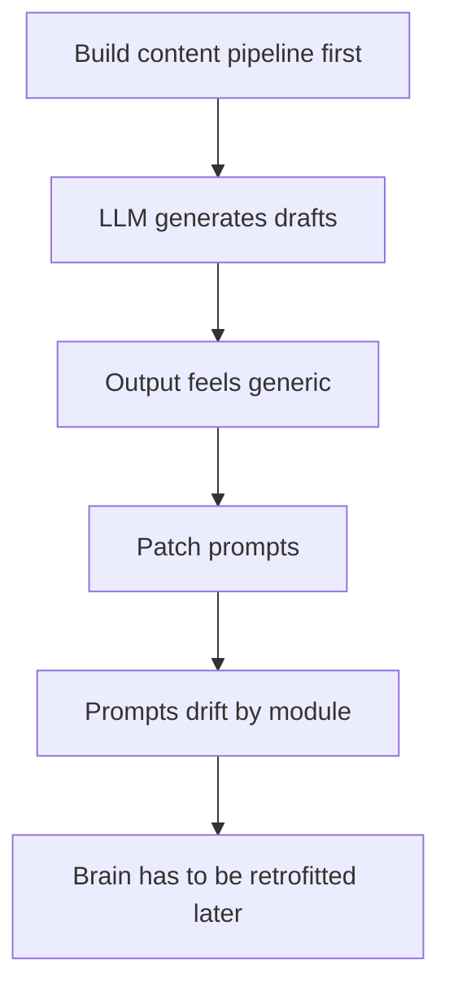

Starting with the brain creates this path:

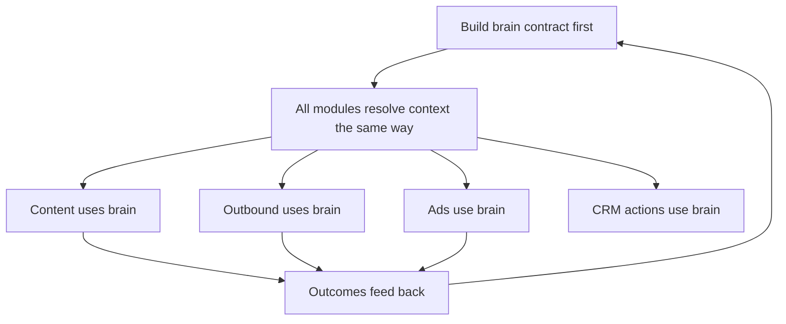

The brain is the platform primitive. Content is the first proof module.

---

## Target Architecture for the Rebuild

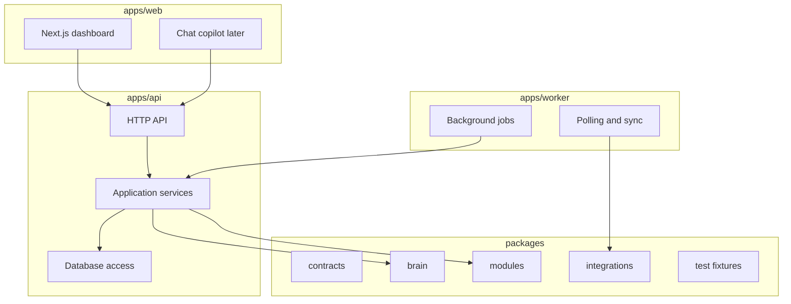

Suggested repo layout:

```text
apps/
  web/
  api/
  worker/
packages/
  contracts/
  brain/
  modules/
  integrations/
  testing/
docs/
  strategy/
  specs/
  plans/
```

The existing repository can be mined for concepts, but the greenfield code should start clean.

---

## Feature Gate Protocol

Every feature moves through the same gate.

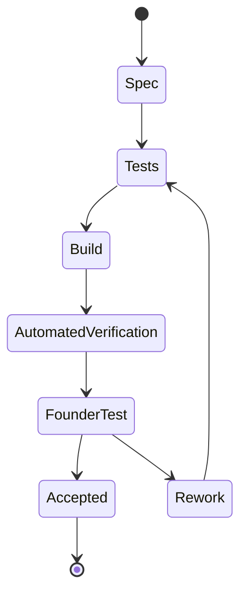

Definition of accepted:

- The feature has a short written spec.
- Unit/API tests cover the core behavior.
- The UI path works locally or in preview.
- The founder has tested the feature manually.
- Any manual feedback is either fixed or explicitly deferred.

---

## Phase 0: Greenfield Foundation

Goal: create a clean, boring base that can be tested from day one.

Build:

- Monorepo skeleton.
- Shared TypeScript/Python contracts, depending on final stack decision.
- Database migration setup.
- Test runner.
- CI command.
- Local dev command.
- Basic health endpoint.
- Basic dashboard shell.

Do not build:

- content pipeline
- RAG
- integrations
- chat
- outbound

Manual acceptance:

- Founder can run the app.
- Dashboard loads.
- API health endpoint responds.
- Test command has visible passing output.

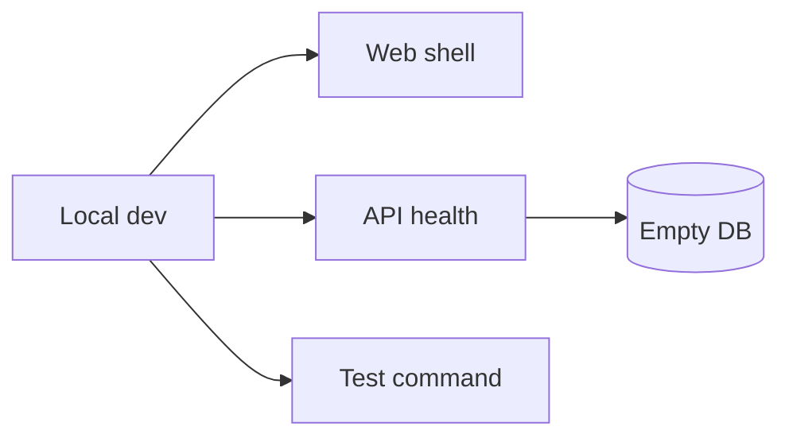

---

## Phase 1: Central Brain v0

Goal: make the brain human-readable, editable, and testable.

Build:

- Workspace.
- Brain docs:
  - `soul`
  - `icp`
  - `voice`
  - `history`
  - `now`
- Brain editor UI.
- Brain version history.
- Brain completeness score.
- Brain export as markdown.

Manual acceptance:

- Founder creates or opens a workspace.
- Founder fills all five docs.
- Founder edits one doc and sees the saved version.
- Founder exports the full brain and can read it as a coherent document.

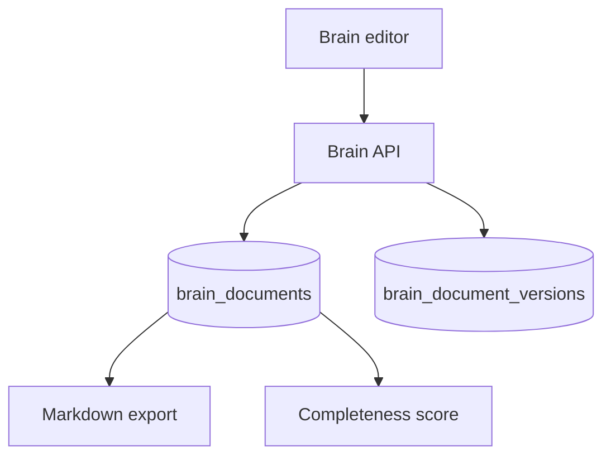

Why this is first:

- It proves the product's trust layer.
- It prevents every module from inventing its own prompt context.
- It creates the demo moment: "the AI knows us because we can read what it knows."

---

## Phase 2: Context Resolver

Goal: turn raw brain docs into a deterministic context bundle for any GTM task.

Build:

- Persona overlay.
- Channel overlay.
- Campaign overlay support with an empty default state.
- Resolver endpoint:
  - input: workspace, task type, channel, persona, optional campaign
  - output: resolved context bundle with ordered sections
- Token budget controls.
- Trace view showing why each section was included.

Manual acceptance:

- Founder creates a CEO persona and a company page persona.
- Same brain resolves differently for each persona.
- Context bundle is readable before any LLM call.

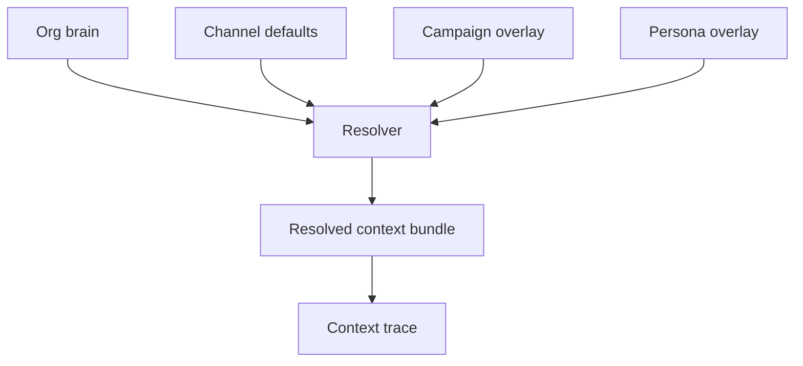

This phase is more important than generation. It makes the system inspectable.

---

## Phase 3: Generation Sandbox

Goal: test whether the brain produces useful outputs before building pipelines.

Build:

- Single "Generate with brain" sandbox.
- Task types:
  - LinkedIn post
  - cold email opener
  - ad copy variant
  - landing page hero
- Prompt trace.
- Output rating:
  - accepted
  - needs edit
  - rejected
- Store rating as training signal.

Manual acceptance:

- Founder selects a task.
- Founder sees resolved context before generation.
- Founder generates output.
- Founder rates output.
- Rating appears in the training signal log.

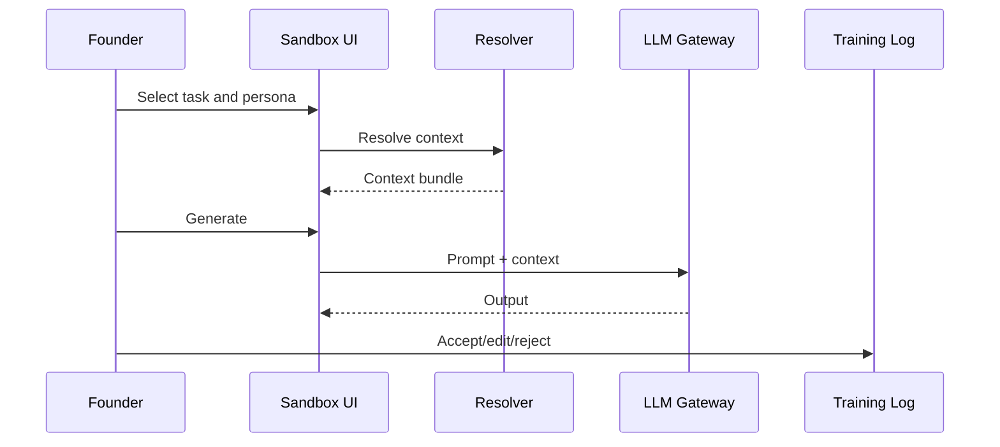

This is the first place to test output quality. If this fails, pipelines would fail too.

---

## Phase 4: Approval Gate

Goal: create the trust mechanism every module will use.

Build:

- Draft object.
- Approval states:
  - draft
  - pending_review
  - approved
  - rejected
  - edited
- Approval queue UI.
- Edit-before-approve.
- Decision log.

Manual acceptance:

- Founder generates a sandbox output into the approval queue.
- Founder edits it.
- Founder approves or rejects it.
- Decision is recorded.

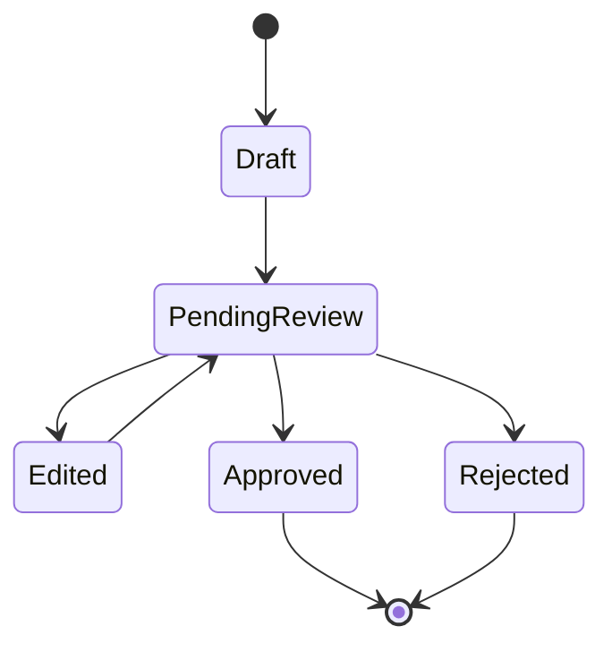

---

## Phase 5: Content Slice v1

Goal: prove the first real module with the fewest moving parts.

Start with manual signal input, not scraping.

Build:

- Manual idea/signal submission.
- Brain-resolved content draft.
- Approval queue.
- Export/copy or post to one platform if credentials are ready.
- Content item status.

Manual acceptance:

- Founder pastes a Reddit/X/LinkedIn signal.
- Tuezday drafts a response using the brain.
- Founder approves it.
- Founder can copy/export/post it.

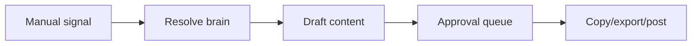

Why not build scrapers first:

- Discovery volume is useless if generation quality is weak.
- Manual signals let the founder test quality with real examples immediately.
- Scrapers can be added after the content action loop works.

---

## Phase 6: Campaigns

Goal: make GTM goal-scoped rather than one-off.

Build:

- Campaign object:
  - objective
  - KPI
  - timeframe
  - audience slice
  - messaging pillars
  - channels
  - personas
- Campaign `now` overlay.
- Campaign-scoped drafts and reporting.

Manual acceptance:

- Founder creates one campaign.
- Campaign changes resolved context.
- New content drafts are tagged to the campaign.

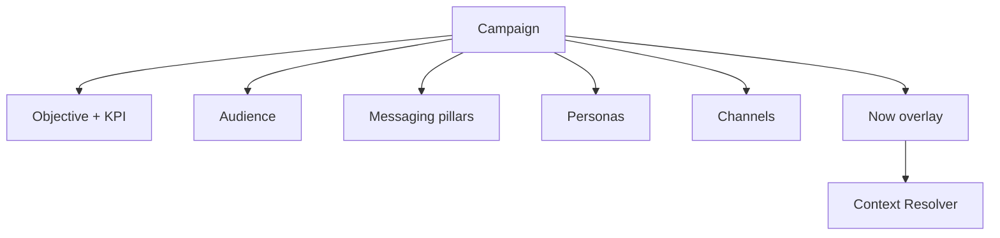

---

## Phase 7: RAG Corpus Integration

Goal: add long-tail evidence retrieval without replacing the five docs.

Use R2R first.

Build:

- Evidence source upload.
- R2R document ingestion.
- Retrieval query from Brain Gateway.
- Citation display.
- Retrieval trace.

Manual acceptance:

- Founder uploads website copy, past posts, or research notes.
- Founder asks a task that needs evidence.
- Output includes cited context.
- Founder can see which source was used.

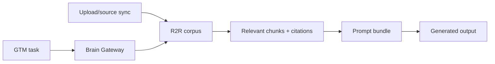

Do not add Graphiti or Mem0 yet. RAG first, graph later.

---

## Phase 8: Signal Discovery

Goal: make discovery shared infrastructure, not content-only scraping.

Build:

- Signal object.
- Source adapters:
  - RSS first
  - Reddit next
  - X/LinkedIn later depending API reliability
- Relevance scoring.
- Campaign assignment.
- Manual triage UI.

Manual acceptance:

- Founder connects or adds one RSS/source.
- Signals appear in an inbox.
- Founder can accept/skip a signal.
- Accepted signal can generate a draft.

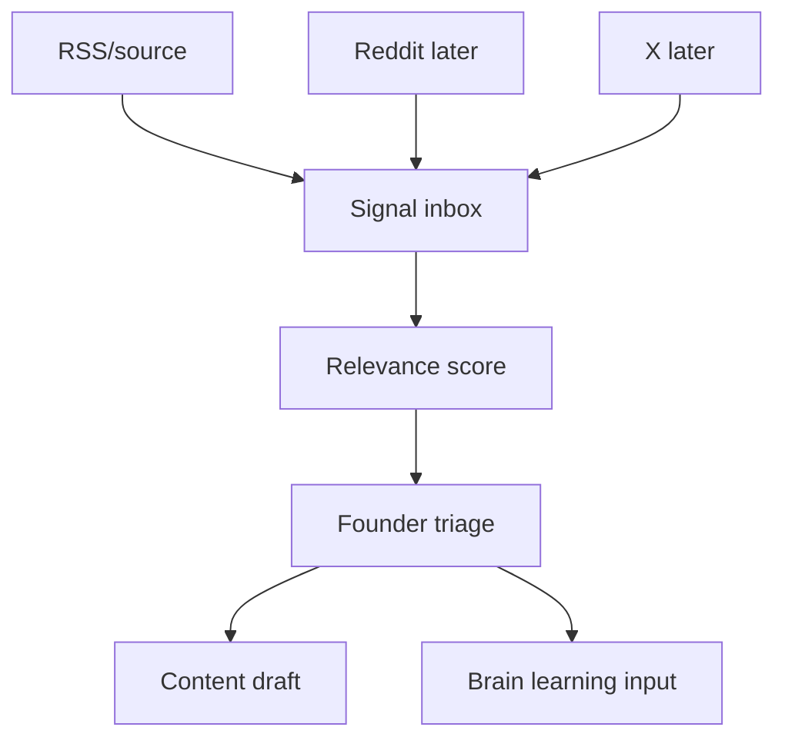

---

## Phase 9: Learning Loop

Goal: make outcomes improve the brain.

Build:

- Training examples from approvals/rejections/edits.
- Engagement metric import.
- Weekly `now` synthesis.
- Human review before writing to `now`.

Manual acceptance:

- Founder approves and rejects several outputs.
- System summarizes what is working.
- Founder reviews proposed `now` changes.
- Approved synthesis updates `now`.

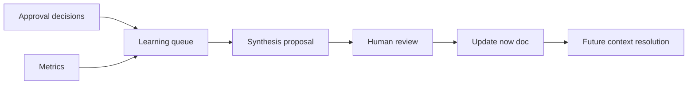

---

## Phase 10: Outbound Slice

Goal: prove the second module uses the same brain.

Start without sending infrastructure.

Build:

- Lead/account input.
- Outbound campaign type.
- Brain-personalized email draft.
- Approval queue.
- CSV/export or send via one external provider after approval.

Manual acceptance:

- Founder imports 5 leads.
- Tuezday generates personalized outbound drafts.
- Founder edits/approves.
- Founder exports or sends through a connected provider.

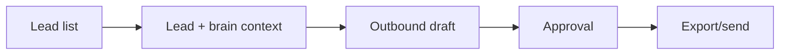

Why outbound after content:

- Content tests public voice and approval.
- Outbound tests personalization and CRM/sender boundaries.
- Both use the same brain, proving multi-module orchestration.

---

## Phase 11: Connector Fabric

Goal: stop writing one-off integrations.

Build:

- Connector registry.
- Connection object.
- Nango proof of concept.
- Webhook/event contract.
- Connector health status.

Manual acceptance:

- Founder connects one external provider.
- Tuezday stores connection status.
- Tuezday can make a test request through the connector.
- Disconnect/reconnect works.

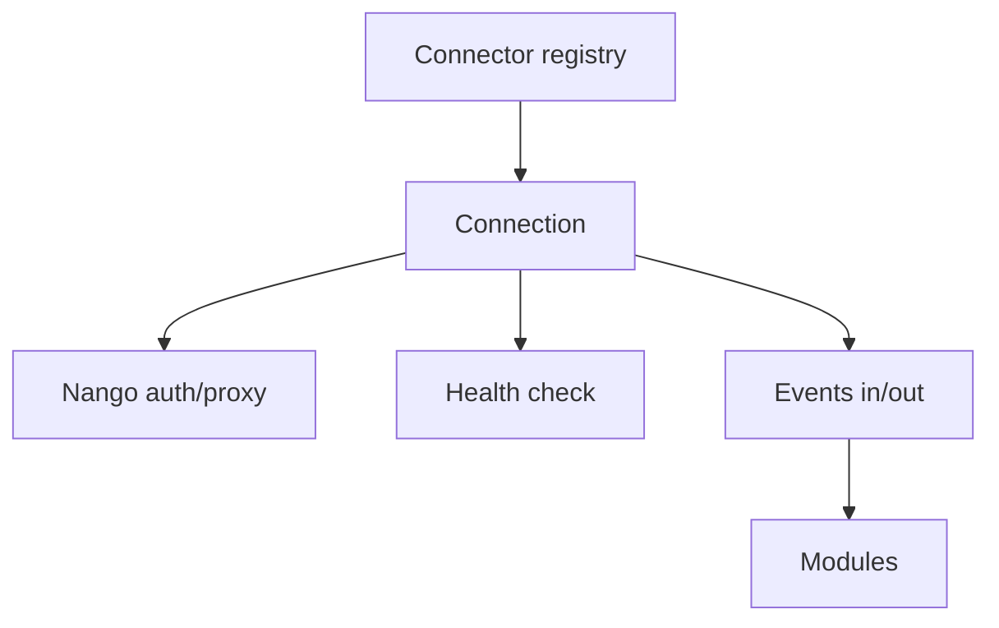

---

## Phase 12: CRM, Ads, Lifecycle, and PR Integrations

Goal: expand breadth only after the core loop is trusted.

Suggested order:

1. CRM read/write.
2. Lifecycle messaging.
3. Ads reporting read-only.
4. Ad creative generation.
5. PR/media outreach.
6. Ads execution only much later.

```mermaid
gantt
    title Integration Expansion Order
    dateFormat YYYY-MM-DD
    axisFormat %b %d

    section Core
    Brain + Resolver           :done, a1, 2026-06-10, 14d
    Content Slice              :a2, after a1, 14d
    Campaigns                  :a3, after a2, 10d

    section Evidence
    RAG Corpus                 :b1, after a3, 10d
    Learning Loop              :b2, after b1, 10d

    section Expansion
    Outbound Slice             :c1, after b2, 14d
    Connector Fabric           :c2, after c1, 12d
    CRM Integration            :c3, after c2, 10d
    Lifecycle Integration      :c4, after c3, 10d
    Ads Reporting              :c5, after c4, 10d
```

Dates are illustrative. The sequence matters more than the calendar.

---

## Human-Testable Milestones

| Milestone | Founder can test | Move on only when |
|---|---|---|
| M0 Foundation | App runs, tests run, health endpoint works | Setup is repeatable |
| M1 Brain docs | Create/edit/export five docs | Brain feels readable and accurate |
| M2 Resolver | Persona/channel/campaign context resolves | Context is inspectable and sensible |
| M3 Sandbox | Generate content/outbound/ad previews | Outputs are directionally useful |
| M4 Approval | Edit/approve/reject generated outputs | Decision log is reliable |
| M5 Content v1 | Manual signal -> draft -> approval -> export/post | First loop works end to end |
| M6 Campaigns | Campaign changes output behavior | Goal-scoped context works |
| M7 RAG | Upload evidence -> cited retrieval | Retrieved context is relevant |
| M8 Discovery | Source -> signal inbox -> draft | Signal quality is acceptable |
| M9 Learning | Decisions/metrics -> proposed `now` update | Founder trusts the learning loop |
| M10 Outbound | Lead list -> personalized drafts -> approval | Second module proves brain reuse |

---

## First Build Slice in Detail

The first feature should be called:

> Brain Spine v0

It includes:

- workspace creation
- five brain docs
- brain editor
- persona overlay
- context resolver
- resolved context preview
- one generation sandbox action

It excludes:

- RAG
- scraping
- posting
- outbound sending
- CRM integrations
- chat copilot
- analytics

```mermaid
flowchart TB
    W[Workspace] --> D[Five brain docs]
    D --> P[Persona overlay]
    P --> R[Resolver]
    R --> PRE[Context preview]
    PRE --> GEN[One generation action]
    GEN --> RATE[Founder rating]
```

This is the smallest slice that proves Tuezday is not just another content tool.

---

## What To Salvage From The Current Codebase

Do not port the code wholesale. Salvage concepts and test cases selectively.

Keep as references:

- prompt/config layering idea
- approval statuses
- draft state machine
- training examples
- webhook/event shape
- content worker lessons
- platform adapter lessons

Do not copy blindly:

- current brain prototype
- cluttered worker structure
- dead or unused model fragments
- UI layout if it fights the new module architecture

```mermaid
flowchart LR
    OLD[Current repo] --> IDEAS[Concepts to keep]
    OLD --> TESTS[Useful tests to rewrite]
    OLD --> DISCARD[Implementation to discard]
    IDEAS --> NEW[Greenfield repo]
    TESTS --> NEW
```

---

## Recommended First 10 Build Tickets

1. Create greenfield repo skeleton and CI.
2. Add database migrations and test database setup.
3. Add workspace model/API/UI.
4. Add brain document model/API tests.
5. Add brain editor UI.
6. Add brain version history and export.
7. Add persona model and persona overlay.
8. Add context resolver service and resolver preview UI.
9. Add LLM gateway with trace logging.
10. Add generation sandbox with accept/edit/reject rating.

Each ticket should be tested and accepted before the next one starts.

---

## Final Build Order

```mermaid
flowchart TD
    A[Foundation] --> B[Central Brain]
    B --> C[Context Resolver]
    C --> D[Generation Sandbox]
    D --> E[Approval Gate]
    E --> F[Manual Content Slice]
    F --> G[Campaigns]
    G --> H[RAG Corpus]
    H --> I[Discovery]
    I --> J[Learning Loop]
    J --> K[Outbound]
    K --> L[Connector Fabric]
    L --> M[CRM/Lifecycle/Ads/PR]
```

Answer to the sequencing question:

1. Central brain first.
2. Resolver second.
3. Generation sandbox third.
4. Approval gate fourth.
5. Manual content slice fifth.
6. Campaigns sixth.
7. RAG and discovery after the first loop works.
8. Outbound after content proves the brain.
9. CRM/ads/lifecycle after connector fabric exists.

This order keeps the rebuild small, inspectable, and hard to fake.
