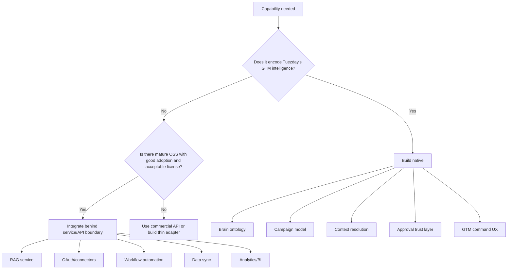
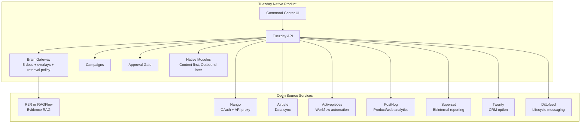
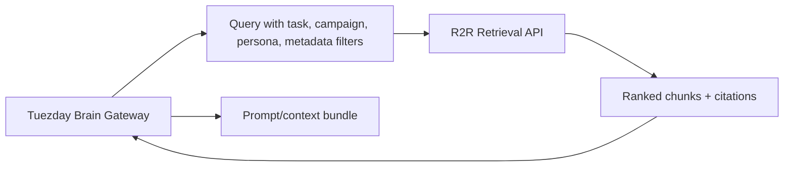
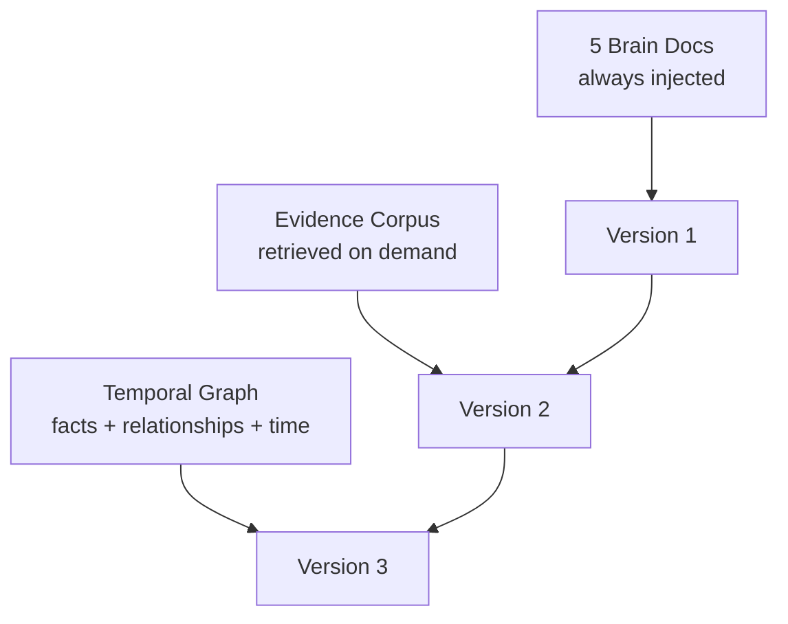
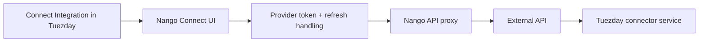
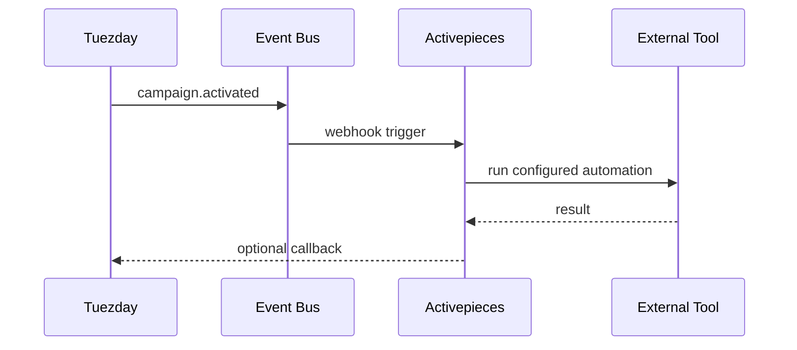
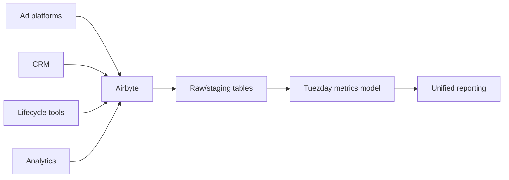
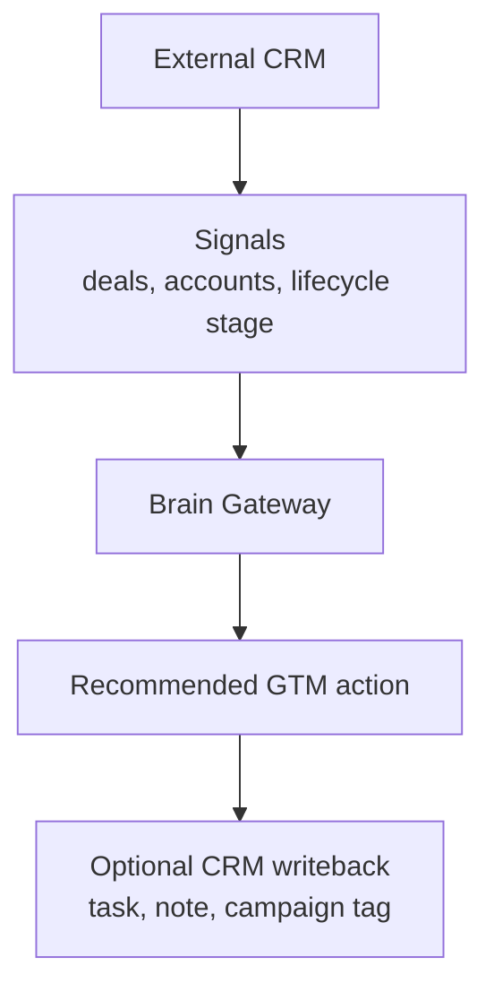
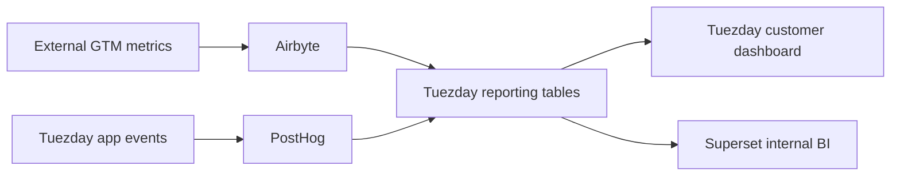
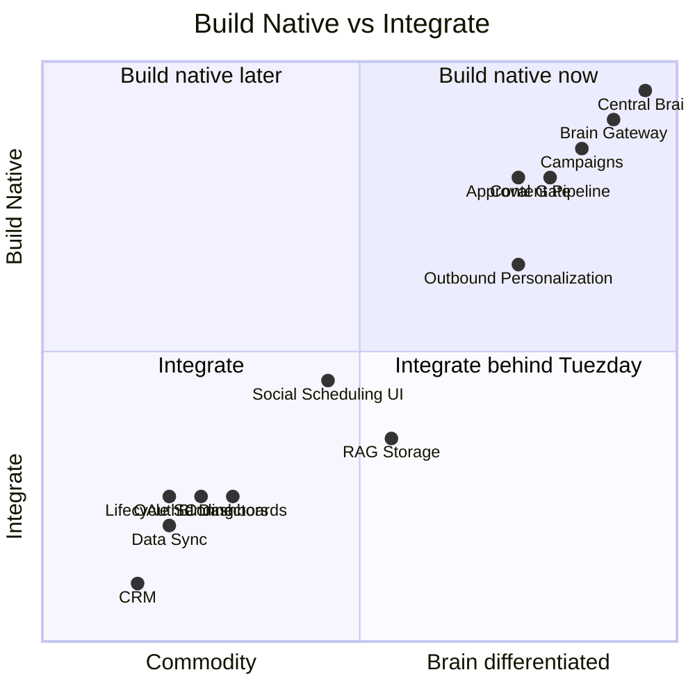

# Tuezday OSS Integration Recommendations

> Date: 2026-06-09
>
> Purpose: Decide which parts of the GTM orchestration platform should be built natively and which can be integrated from mature open source projects without weakening product quality, speed, or the central brain moat.

---

## Executive Recommendation

Tuezday should not fork a large all-in-one GTM, CRM, automation, or social media platform. The product should remain a native orchestration layer with a proprietary brain ontology, campaign model, approval layer, and GTM-specific UX.

Use open source projects behind service boundaries for commodity or infrastructure-heavy capabilities:

- RAG and evidence retrieval: R2R first, RAGFlow as backup.
- Product integrations and OAuth: Nango if its Elastic license is acceptable behind a service boundary.
- External workflow automation: Activepieces.
- Data sync and connector ingestion: Airbyte.
- CRM option for demo/internal use: Twenty.
- Lifecycle messaging: Dittofeed.
- Product/web analytics: PostHog.
- BI/internal dashboards: Apache Superset.
- CMS for owned content: Payload first, Strapi as a CMS-heavy alternative.

The core Tuezday brain remains native:

- `soul`
- `icp`
- `voice`
- `history`
- `now`
- org -> channel -> campaign -> persona resolution
- prompt/context assembly
- approval and learning loop

---

## Decision Principle

---

## Recommended System Shape

---

## 1. Central Brain RAG Corpus

### Recommendation: R2R first

Use R2R as the first external RAG service for the evidence corpus.

R2R is a production-oriented retrieval system with REST APIs, multimodal ingestion, hybrid search, knowledge graphs, document management, user/access management, and RAG with citations. It is MIT licensed, API-first, and easier to treat as a headless brain service than a full product shell.

Verified snapshot on 2026-06-09:

- Repo: https://github.com/SciPhi-AI/R2R
- License: MIT
- Stars: about 7.9k
- Forks: about 635
- Fit: high for a backend brain/RAG service

### Alternatives

| Candidate | License | Strength | Weakness | Verdict |
|---|---|---|---|---|
| R2R | MIT | API-first, production RAG, hybrid search, KG support, auth/collections | Smaller community than RAGFlow | Choose first |
| RAGFlow | Apache-2.0 | Very high adoption, full RAG product, strong document workflow | Heavier product; more UI/platform surface than we need | Backup or use if parsing/UI wins |
| AnythingLLM | MIT | Large adoption, workspaces, private RAG app, easy to demo | More chatbot/product shell than retrieval service | Good demo tool, not core service |
| Dify | Custom Apache-derived license with extra conditions | Workflows, apps, RAG, observability | Too much platform overlap; license needs care | Avoid as core |
| Haystack | Apache-2.0 | Mature RAG/orchestration framework | More framework than service; we must operate retrieval details | Use only if building RAG ourselves |
| LlamaIndex | MIT | Huge ecosystem for data connectors and RAG components | Framework abstraction, not a deployable brain service by itself | Use selectively for parsers/tools |

### Why R2R beats the alternatives

R2R fits the exact boundary we want:

RAGFlow is stronger if we want a full RAG application. That is also its drawback. Tuezday should not expose a second product UI or let a RAG platform define the brain model.

AnythingLLM is excellent for internal exploration and demos, but it is chat/workspace oriented. Tuezday needs retrieval as infrastructure, not a general private ChatGPT clone.

Haystack and LlamaIndex are useful if we build our own retrieval stack, but that increases engineering load. The current goal is efficiency.

### Implementation posture

Keep these native:

- brain document schema
- overlay resolution
- retrieval policy
- prompt packing
- context scoring
- citations shown in Tuezday UI

Delegate these:

- document parsing
- chunk storage
- hybrid retrieval
- embedding/indexing
- citation retrieval

---

## 2. Temporal Knowledge and Memory

### Recommendation: defer, then add Graphiti before Mem0

Graphiti is a better long-term fit than generic memory for GTM because GTM knowledge is temporal:

- current campaign vs old campaign
- current offer vs retired offer
- competitor positioning changing over time
- ICP changes by segment
- what worked last week vs last quarter

Use Graphiti after the basic RAG corpus exists.

Sources:

- Graphiti: https://github.com/getzep/graphiti
- Mem0: https://github.com/mem0ai/mem0

### Alternatives

| Candidate | Strength | Weakness | Verdict |
|---|---|---|---|
| Graphiti | Temporal knowledge graph designed for agent memory and changing facts | Adds graph complexity | Add later for GTM intelligence |
| Mem0 | Strong user/session/agent memory, good personalization | More assistant-memory oriented than GTM knowledge graph | Add later for copilot/user preferences |
| Neo4j + custom pipeline | Mature graph DB | We build extraction, temporal ranking, retrieval logic | Too much work early |
| Letta | Stateful agent platform | Agent-centric, not central GTM brain infra | Avoid as core |

### Why not now

The first version needs a readable, editable brain. RAG and graph memory should support that model, not replace it.

---

## 3. Product Integrations and OAuth

### Recommendation: Nango, behind a boundary

Nango handles OAuth, API keys, token refresh, credential storage, an authenticated proxy, retries, rate limits, and multi-tenant connection management for many APIs.

Verified snapshot on 2026-06-09:

- Repo: https://github.com/NangoHQ/nango
- License: Elastic License
- Claimed API coverage: 800+ APIs
- Production users listed by project: Replit, Ramp, Mercor, and others
- Fit: high for connector auth and proxying, with licensing caution

### Alternatives

| Candidate | License | Strength | Weakness | Verdict |
|---|---|---|---|---|
| Nango | Elastic | Purpose-built product integrations, OAuth, proxy, token refresh | Not permissive OSS | Use as service boundary if license acceptable |
| Pipedream | Source available | Large integration ecosystem | License restricts SaaS integration-platform use | Avoid for embedded product registry |
| Activepieces | MIT CE | Automation + connectors | Less specialized for OAuth/product integration auth | Use for workflows, not credential core |
| n8n | Sustainable Use License | Massive adoption and integrations | Source-available/fair-code, workflow-first | Avoid as embedded core |
| Custom OAuth vault | Native control | High maintenance across providers | Build only for 1-2 critical providers if needed |

### Why Nango wins

Nango maps directly to the missing "integration fabric" primitive in the GTM map:

The license is the main risk. Do not mix Nango code into Tuezday's product codebase unless legal review approves it. Treat it as an independently deployed integration service.

---

## 4. Workflow Automation

### Recommendation: Activepieces

Activepieces is the best default for non-core customer/internal automations. Its Community Edition is MIT licensed, has strong adoption, many pieces, human-in-the-loop support, and MCP-oriented tooling.

Verified snapshot on 2026-06-09:

- Repo: https://github.com/activepieces/activepieces
- License: MIT for Community Edition
- Stars: about 22.7k
- Forks: about 3.8k
- Positioning: open source replacement for Zapier

### Alternatives

| Candidate | License | Strength | Weakness | Verdict |
|---|---|---|---|---|
| Activepieces | MIT CE | Good UX, broad pieces, HITL, AI/MCP direction | Some enterprise features commercial | Choose |
| n8n | Sustainable Use License | Very mature, 400+ integrations, huge adoption | License less clean for embedding/commercial platform | Use only externally |
| Windmill | AGPL/commercial model | Developer-grade scripts, workflows, UIs, fast engine | More infra/devops oriented | Use for internal ops if needed |
| Temporal | MIT | Durable workflow engine | Low-level; not integration marketplace | Use only for native critical workflows |

### How to use it

Activepieces should not run Tuezday's core content generation or approval logic. Use it for:

- notify Slack when a campaign is approved
- send a webhook to CRM
- sync a lead list to a sheet
- trigger external tasks after Tuezday emits an event

---

## 5. Data Sync and Reporting Inputs

### Recommendation: Airbyte

Airbyte is the best default for moving data from external GTM systems into Tuezday's reporting warehouse or Postgres staging tables.

Verified snapshot on 2026-06-09:

- Repo: https://github.com/airbytehq/airbyte
- Stars: about 21.4k
- Forks: about 5.2k
- Connectors: 600+
- Fit: high for ads/CRM/lifecycle/reporting sync

### Alternatives

| Candidate | Strength | Weakness | Verdict |
|---|---|---|---|
| Airbyte | Broad connector catalog, mature ELT | Operational footprint | Choose for connector ingestion |
| Meltano/Singer | Lightweight, open ecosystem | More assembly required | Use only if Airbyte is too heavy |
| RudderStack | Strong event/CDP movement | Less broad as GTM source sync | Use if CDP becomes core |
| Custom sync jobs | Simple for first provider | Becomes maintenance drain quickly | Accept only for first spike |

### Why Airbyte wins

Reporting and attribution need data from many systems. Building every sync ourselves compromises efficiency and reliability.

---

## 6. CRM and Pipeline

### Recommendation: integrate real customer CRMs; use Twenty only as OSS fallback

Most target customers will already use HubSpot, Salesforce, Pipedrive, or spreadsheets. Tuezday should not become a CRM. It should read/write CRM context and use CRM signals in campaigns.

Twenty is the best OSS fallback for a demo environment or customers without an existing CRM.

Verified snapshot on 2026-06-09:

- Repo: https://github.com/twentyhq/twenty
- Stars: about 49.5k
- Forks: about 7.1k
- Positioning: open alternative to Salesforce, designed for AI

### Alternatives

| Candidate | Strength | Weakness | Verdict |
|---|---|---|---|
| Twenty | Modern, AI-oriented, strong adoption | Another product to operate | Use as optional demo/fallback CRM |
| SuiteCRM | Mature | Older UX and architecture | Avoid unless customer already uses it |
| EspoCRM | Lightweight CRM | Less modern ecosystem | Possible small-business fallback |
| Odoo CRM | Broad business suite | Too much platform gravity | Avoid as core |
| HubSpot/Salesforce/Pipedrive | Customer-standard systems | Commercial APIs | Primary integration targets |

### Tuezday's CRM boundary

---

## 7. Lifecycle Messaging

### Recommendation: Dittofeed for lifecycle journeys

Dittofeed is MIT licensed and focused on customer engagement journeys across email, SMS, push, WhatsApp, Slack, and more. It is a good fit for lifecycle orchestration when this becomes real scope.

Verified snapshot on 2026-06-09:

- Repo: https://github.com/dittofeed/dittofeed
- License: MIT
- Stars: about 2.8k
- Forks: about 353
- Fit: good for Customer.io-style lifecycle automation

### Alternatives

| Candidate | License | Strength | Weakness | Verdict |
|---|---|---|---|---|
| Dittofeed | MIT | Dev-friendly, journey builder, multi-channel | Smaller adoption than Mautic | Choose when lifecycle scope starts |
| Mautic | GPL | Very mature marketing automation | PHP stack, heavy, older UX | Good external integration, not embedded |
| Listmonk | AGPLv3 | Excellent newsletter/broadcast manager | Not full lifecycle automation | Use only for newsletters |
| Novu | Mixed/commercial | Notification infra | Not marketing lifecycle orchestration | Use for product notifications, not GTM |

---

## 8. Analytics and Reporting

### Recommendation: PostHog for product/web analytics, Superset for internal BI

Use PostHog to collect product and web analytics. Use Superset for internal BI dashboards or admin-facing query exploration. Build the customer-facing GTM dashboard natively in Tuezday so the metrics reflect Tuezday's campaign and brain model.

Verified snapshot on 2026-06-09:

- PostHog: https://github.com/PostHog/posthog
- PostHog stars: about 34.9k
- PostHog license: MIT expat for repo except enterprise directory
- Superset: https://github.com/apache/superset
- Superset license: Apache-2.0

### Alternatives

| Candidate | Strength | Weakness | Verdict |
|---|---|---|---|
| PostHog | Product/web analytics, replays, flags, experiments, CDP | Large system | Use for behavior/conversion events |
| Superset | Mature BI, SQL, dashboards, Apache project | Not a product analytics SDK | Use for internal/admin BI |
| Metabase | Easy BI | License/commercial split needs review | Good alternative to Superset |
| Plausible | Lightweight web analytics | Narrow scope | Use only if privacy-first web analytics is enough |
| RudderStack | Event/CDP pipeline | Not final analytics UX | Use if CDP layer is needed |

### Reporting split

---

## 9. Owned Content CMS

### Recommendation: Payload first, Strapi second

Only introduce a CMS if owned content becomes real product scope: blog posts, landing pages, research reports, case studies, changelog, and content approvals.

Payload is the better first fit for Tuezday because it is TypeScript/Next-oriented and can live closer to the app architecture. Strapi is better if the CMS must be used by non-technical content teams immediately and needs broader plugin/community maturity.

### Alternatives

| Candidate | Strength | Weakness | Verdict |
|---|---|---|---|
| Payload | MIT, TypeScript, Next-oriented, code-first | Smaller than Strapi | Choose if we need CMS |
| Strapi | Very large adoption, strong admin CMS | Separate Node product and CMS conventions | Choose if CMS-heavy |
| Directus | Database-first, instant APIs | BSL license changed; commercial threshold concern | Avoid unless license accepted |
| WordPress | Ubiquitous | Not a good fit for Tuezday native app architecture | Integrate externally only |

---

## 10. Social Scheduling and Publishing

### Recommendation: keep Tuezday native; use Postiz only as reference

Postiz is a strong OSS social scheduling product, but Tuezday's content loop is differentiated by discovery, relevance, brain-driven generation, approval, and learning. Forking Postiz would pull the product toward scheduling UI instead of GTM orchestration.

Verified snapshot on 2026-06-09:

- Repo: https://github.com/gitroomhq/postiz-app
- License: AGPL-3.0
- Stars: about 31.6k
- Forks: about 5.9k

### Alternatives

| Candidate | Strength | Weakness | Verdict |
|---|---|---|---|
| Postiz | Strong adoption, broad social scheduling, API | AGPL; product overlap | Reference only |
| Mixpost | Focused self-hosted scheduler | Laravel/PHP stack, less orchestration fit | Reference only |
| Buffer/Hypefury/etc. | Mature commercial tools | Not OSS, not brain-native | Integrate later if needed |

---

## 11. Outbound Sending and Deliverability

### Recommendation: do not build sending infra; integrate senders

Outbound is differentiated at the personalization and orchestration layer, not in SMTP warmup, inbox rotation, bounce handling, or deliverability.

Use Tuezday for:

- lead context selection
- brain-personalized messaging
- campaign sequencing logic
- approval and safety
- reply intelligence

Use external systems for:

- cold email sending
- domain warmup
- inbox rotation
- deliverability controls
- unsubscribe/compliance mechanics

Initial targets:

- Smartlead
- Instantly
- Apollo/Clay for lead sourcing/enrichment
- HubSpot/Salesforce/Pipedrive for CRM writeback

OSS fallback options like Postal can run mail infrastructure, but they do not replace cold outbound deliverability products.

---

## 12. Final Selection Matrix

| Layer | Primary Choice | Backup | Native Tuezday Boundary |
|---|---|---|---|
| Brain docs and overlays | Native | None | Must own |
| RAG corpus | R2R | RAGFlow | Brain Gateway owns retrieval policy |
| Temporal GTM graph | Graphiti later | Neo4j custom | Only after RAG is useful |
| User/session memory | Mem0 later | Native simple prefs | Only for copilot personalization |
| OAuth/product integrations | Nango | Custom for first 1-2 providers | Keep license boundary |
| Workflow automation | Activepieces | n8n external only | Core workflows stay native |
| Data sync | Airbyte | Meltano/Singer | Tuezday owns metric model |
| CRM | Existing customer CRM | Twenty | Tuezday is not a CRM |
| Lifecycle | Dittofeed | Mautic/Listmonk by use case | Tuezday writes strategy/context |
| Product/web analytics | PostHog | Plausible | Tuezday owns GTM dashboard |
| BI | Superset | Metabase | Internal/admin first |
| CMS | Payload | Strapi | Only when owned content ships |
| Social scheduler | Native | Postiz reference | Do not fork scheduler as core |

---

## Build vs Integrate Summary

---

## Immediate Next Step

Start with a greenfield Tuezday core that can call external services, but do not install all services on day one.

First three integrations to spike:

1. R2R, because it validates the brain service boundary.
2. Nango, because it validates the connector fabric.
3. PostHog, because it validates event capture and feedback.

Everything else waits until the native brain and first content loop are stable.
