# Tuezday Product Strategy and Positioning

> Date: 2026-06-10
>
> Purpose: Explain what Tuezday is trying to become, what problem it solves, what it is not, and what the end product should feel like at a strategic level. This is not a technical architecture document.

---

## The Simple Version

Tuezday is building the memory layer for modern GTM.

Most companies do not have a content problem, an outbound problem, an ads problem, or a CRM problem in isolation. They have a context problem.

The founder knows the positioning. Sales hears the objections. Ads learn which angle works. Content finds language the market responds to. The CRM holds fragments of truth. Then every new campaign starts like none of that happened.

Tuezday gives a company one shared GTM brain, then uses that brain to orchestrate content, outbound, paid, lifecycle, CRM, PR, and reporting.

The product is not "more AI content." The product is GTM that remembers.

---

## One-Line Product Definition

> Tuezday is a GTM orchestration platform that gives every campaign, channel, and tool one shared brain, so a company's marketing and sales work compounds instead of resetting every week.

Shorter:

> Tuezday helps your GTM stop forgetting what it already learned.

---

## Why This Needs To Exist

Modern GTM has become tool-heavy and memory-poor.

Teams have more channels than ever:

- founder-led content
- LinkedIn
- X
- Reddit
- newsletters
- SEO
- paid ads
- cold email
- LinkedIn outbound
- CRM
- lifecycle messaging
- launch communities
- PR
- webinars
- sales calls
- analytics

But the learning across those channels does not move cleanly.

Your ad campaign learns that one pain point converts. Your outbound sequence never sees it.

Your sales calls reveal a recurring objection. Your landing page still ignores it.

Your founder writes a post that finally explains the product well. Your next email campaign starts from a blank prompt.

Your CRM has data, but not a living sense of what the company believes, who it sells to, what the market is saying, or what worked last week.

That is the gap Tuezday is built to close.

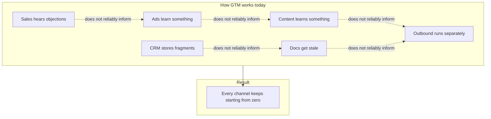

---

## The Problem We Are Solving

### 1. GTM context is scattered

The important context is everywhere:

- in founder notes
- in customer calls
- in ad dashboards
- in CRM fields
- in Slack threads
- in sales decks
- in old launch docs
- in rejected drafts
- in comments under posts
- in outbound replies

No single system understands the company well enough to help across channels.

That is why most AI output feels generic. The model is not always the issue. The missing context is.

### 2. GTM tools execute, but they do not remember together

Most GTM tools are built around jobs:

- schedule a post
- send an email
- update a CRM field
- launch an ad
- create a landing page
- track a conversion

Those jobs matter. But they are not the real strategic layer.

The strategic layer is memory:

- What are we selling?
- Who are we for?
- What do buyers care about?
- What proof do we have?
- What objections keep coming up?
- What channels are working?
- What campaign are we pushing right now?
- What should we stop saying?

Tuezday sits above the tools that execute the jobs.

### 3. AI made output cheaper, but not necessarily better

AI makes it easy to create more:

- more LinkedIn posts
- more emails
- more ad variants
- more landing page copy
- more scripts
- more campaign ideas

But more output is not the same as better GTM.

Without shared context, AI becomes another disconnected tab. It can write, but it does not know what the last campaign learned. It does not know what the founder would reject. It does not know which promise sales can actually defend.

Tuezday is built around the opposite idea:

> AI only becomes useful for GTM when it has the same memory the company wishes its team had.

### 4. Founder knowledge does not scale

In early-stage companies, the founder is usually the best GTM brain.

They know:

- why the company exists
- who the product is really for
- what words are wrong
- which customer story matters
- what the market misunderstands
- what the current push is
- what is too cringe to publish

The problem is that this knowledge lives in one or two heads. Every new hire, tool, agency, and AI chat needs the same context again.

Tuezday turns that founder context into a living GTM brain the whole system can use.

### 5. Feedback loops die before they become strategy

Teams collect feedback constantly, but it rarely becomes reusable intelligence.

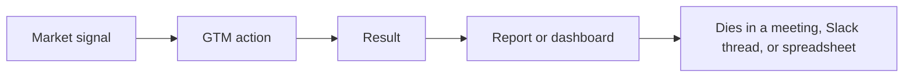

Tuezday changes the loop:

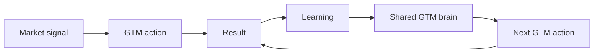

---

## What Tuezday Is

Tuezday is the orchestration layer for GTM.

It connects what the company knows, what the market is saying, what the team is trying to do, and what each channel is executing.

At the center is the GTM brain.

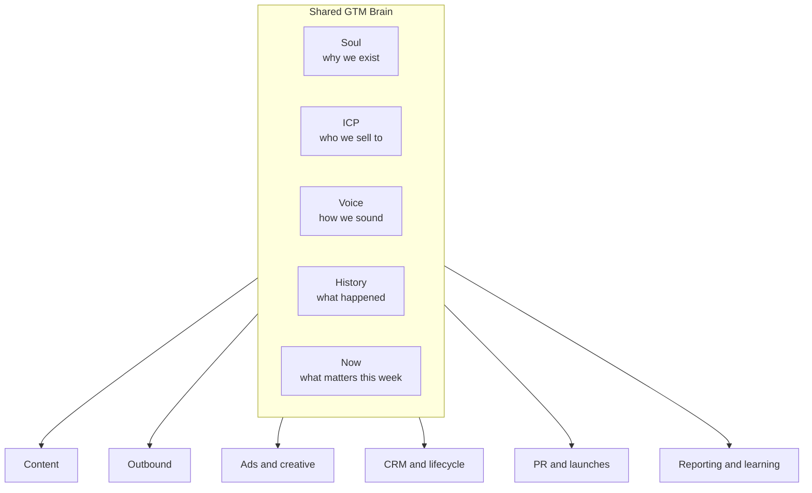

Tuezday helps a company:

- define its GTM brain
- launch campaigns from that brain
- generate work across channels
- keep humans in control
- learn from outcomes
- update the brain over time
- carry those learnings into the next campaign

It is not trying to replace every GTM tool. It is trying to make them stop acting like they work at different companies.

---

## The Core Thesis

GTM should be a compounding system.

Today, most GTM systems reset.

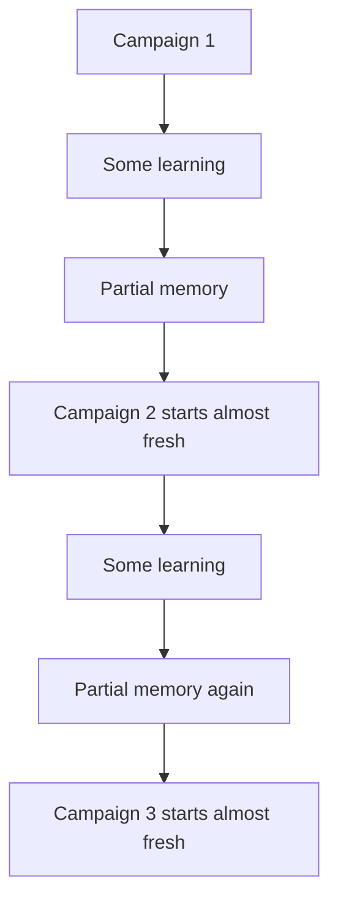

Tuezday is built for compounding:

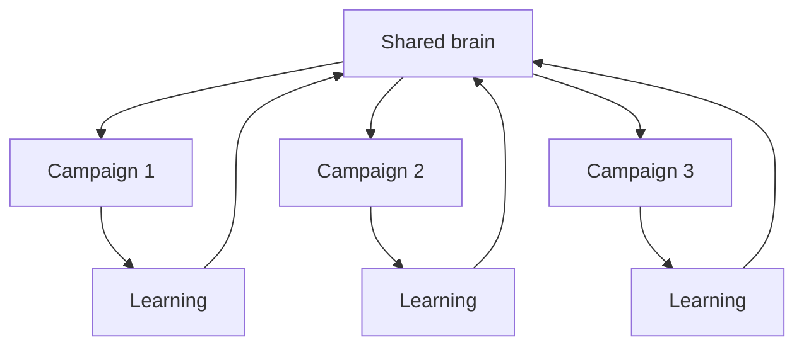

The product wins if every campaign starts with more usable context than the last one.

---

## Who We Are Building For

The first audience is founder-led SaaS companies and small GTM teams.

They usually have:

- a fast-changing product
- a founder who still owns much of positioning
- multiple channels already in motion
- scattered GTM docs
- inconsistent AI output
- limited team bandwidth
- pressure to look bigger and sharper than they are
- a need to move fast without sounding generic

They do not need another place to make content for the sake of content.

They need a system that can help them:

- remember what matters
- coordinate campaigns
- turn market signals into action
- keep voice and positioning consistent
- make each channel learn from the others

---

## What Tuezday Is Not

This matters as much as what it is.

### Tuezday is not a content scheduler

Scheduling posts is a feature, not the company.

Tuezday may publish, schedule, and manage content. But the point is not to become Buffer with AI copy. The point is to make content part of a larger GTM loop.

### Tuezday is not a generic AI writer

Generic AI writing tools start with a prompt.

Tuezday starts with the company's brain, current campaign, channel context, and what the market has already taught you.

If the product becomes "type a prompt, get content," it has lost the plot.

### Tuezday is not a CRM

CRMs store relationships, pipeline, activities, and account history.

Tuezday should integrate with CRMs, read from them, and write useful GTM context back into them. It should not try to replace Salesforce, HubSpot, or Pipedrive.

The CRM is a source and destination. It is not the brain.

### Tuezday is not an ads manager

Tuezday should help generate, test, understand, and improve ad strategy and creative.

It should not try to become the place where media buyers manage every bid, budget, and placement detail.

Ad platforms are execution surfaces. Tuezday is the intelligence and orchestration layer above them.

### Tuezday is not a workflow automation tool

Zapier-style automation moves data from one place to another.

Tuezday makes decisions about what GTM should do next, using the company's context and feedback loops.

Automation can support Tuezday. It is not the product.

### Tuezday is not a replacement for the whole GTM stack

The end goal is not to make every customer abandon every tool.

The end goal is to make the tools they already use work from shared memory.

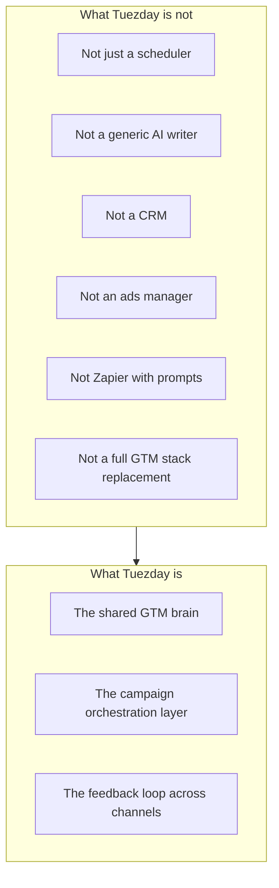

---

## What The End Product Looks Like

The finished product should feel like a GTM command center.

Not a blank AI chat.
Not a spreadsheet.
Not a social scheduler.
Not a dashboard full of disconnected metrics.

It should feel like one place where a founder or GTM lead can answer:

- What are we trying to do right now?
- What does the company believe?
- Who are we targeting?
- What did the market tell us recently?
- What campaigns are live?
- What content, outbound, ads, lifecycle, and PR work is queued?
- What needs approval?
- What worked?
- What should we do next?

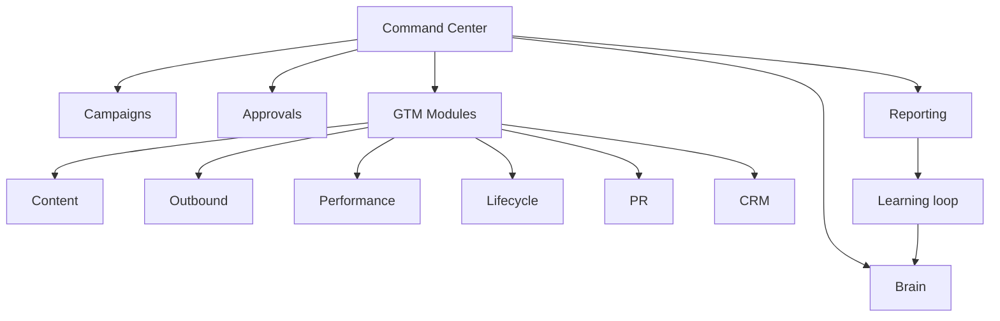

### 1. Command Center

The home screen shows the state of GTM:

- active campaigns
- today's approvals
- signals worth acting on
- modules connected
- what changed this week
- what the system recommends next

The user should not need to hunt through six tools to understand what is happening.

### 2. Brain

The Brain is visible and editable.

This is a trust moment. The user should be able to open it and say, "Yes, this is what we believe, who we sell to, and how we sound."

The Brain is not hidden inside embeddings or prompt templates. The core brain is readable.

### 3. Campaigns

Campaigns are the main unit of action.

A campaign says:

- what we are trying to achieve
- who we are targeting
- what channels are in play
- what message pillars matter
- who is speaking
- what success looks like

Then Tuezday turns that campaign into coordinated work across channels.

### 4. Approval Queue

Humans stay in control.

Tuezday drafts, recommends, assembles, and learns. The human approves, edits, rejects, and teaches the system what good looks like.

### 5. Modules

Modules are the execution surfaces:

- Content
- Outbound
- Ads and creative
- Lifecycle
- PR
- CRM

The modules do not each have their own separate brain. They all resolve context from the same shared system.

### 6. Reporting and Learning

Reporting is not just "what happened."

Reporting should answer:

- what worked
- why it may have worked
- where the same learning should be reused
- what the brain should remember
- what the next action should be

---

## The Product Loop

The end product is a loop, not a collection of features.

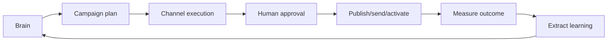

Every feature should strengthen this loop.

If a feature does not help the system know more, act better, or learn faster, it is probably not a priority.

---

## The User Journey

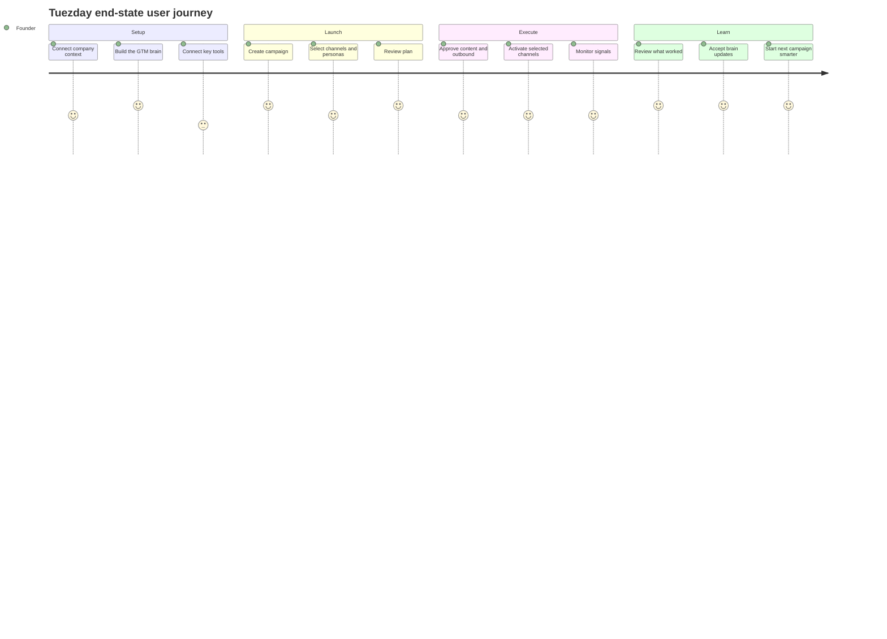

The emotional arc should be:

1. "Finally, the system understands us."
2. "It knows what we are trying to do this month."
3. "It is producing useful GTM work without me re-explaining everything."
4. "It is learning from what happened."
5. "The next campaign is starting from a better place."

---

## Product Pillars

### Pillar 1: Shared Brain

The brain is the source of truth for the company's GTM identity and learning.

It contains the durable context:

- soul
- ICP
- voice
- history
- now

It also grows from evidence:

- past content
- calls
- CRM notes
- campaign outcomes
- market signals
- approved and rejected drafts

### Pillar 2: Campaign Orchestration

Campaigns turn strategy into coordinated action.

Without campaigns, the product becomes a pile of useful tools. With campaigns, it becomes a GTM operating layer.

### Pillar 3: Human-Controlled Automation

Tuezday should not make users feel like GTM is happening behind their back.

The product should make the next action obvious, draft the work, explain the context, and ask for approval where trust matters.

### Pillar 4: Multi-Channel Execution

Tuezday should eventually support every major GTM motion:

- content
- outbound
- ads
- lifecycle
- PR
- CRM actions
- reporting

But it should not build every execution surface from scratch. It should integrate commodity systems and own the intelligence layer.

### Pillar 5: Learning Loop

The product should get sharper as the company uses it.

Not because it magically knows everything. Because every campaign, approval, rejection, signal, and result has somewhere to go.

---

## Strategic Product Map

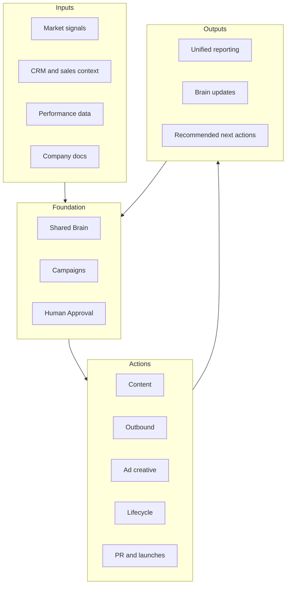

---

## The End-State Product In Plain English

A founder opens Tuezday and sees:

- the active GTM campaigns
- what each campaign is trying to do
- what the system knows about the company
- which channels are live
- which drafts or actions need approval
- which market signals are worth acting on
- what the last campaign taught the system
- what should happen next

They can say:

> Launch a hiring campaign for senior backend engineers. Use the CEO and CTO voices. Push on LinkedIn and outbound. Make it feel technical, not corporate.

Tuezday responds with:

- a campaign plan
- suggested personas and channels
- message pillars
- draft posts
- outbound angles
- approval queue
- reporting targets
- a learning loop back into the brain

That is the product.

Not the chat alone. Not the dashboard alone. Not the content alone. The whole loop.

---

## What Success Looks Like

Tuezday is working if customers say:

- "I do not have to re-explain our company every time."
- "Our campaigns feel more consistent."
- "Our content, outbound, and ads finally sound like the same company."
- "The system remembers what worked."
- "Approving work is faster because the first draft is closer."
- "We can launch GTM motions without rebuilding context from scratch."
- "The founder is no longer the only place the GTM brain lives."

The most important success metric is not volume of output.

It is context reuse.

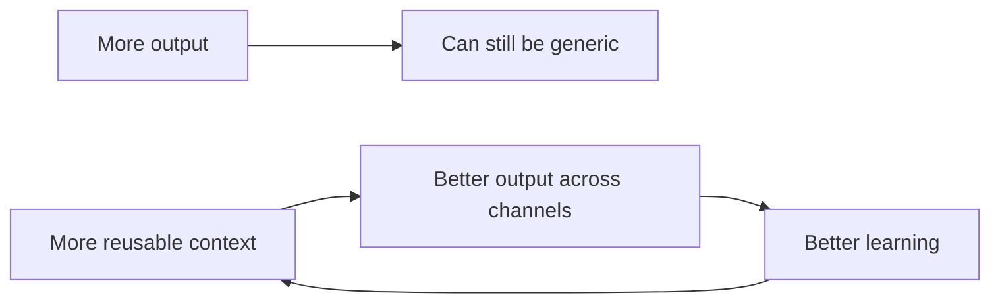

---

## What We Should Refuse To Optimize For

Tuezday should not optimize for:

- maximum content volume
- fully autonomous posting without trust
- replacing every GTM tool
- being the cheapest scheduler
- being the broadest automation marketplace
- hiding the brain inside opaque AI magic
- shipping disconnected modules for the sake of breadth

Tuezday should optimize for:

- context quality
- campaign coherence
- trust
- clarity
- reusable learning
- founder-grade output
- multi-channel consistency

---

## Strategic Sequence

The product should grow in this order:

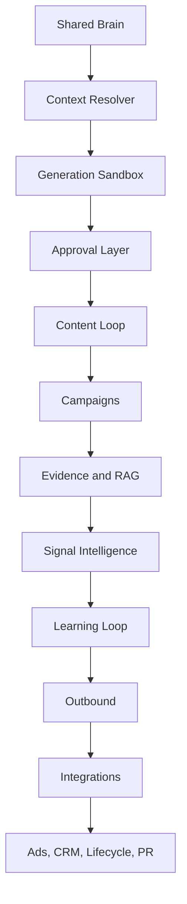

The reason is simple:

> The brain has to exist before the work can compound.

Content is the first proof module because it is visible, founder-testable, and close to the current product. But the company is not a content tool. The company is the shared GTM brain and orchestration loop that content proves first.

---

## The Strategic Bet

The bet is that the next generation of GTM software is not another single-channel tool.

It is not another AI writer.
It is not another CRM.
It is not another dashboard.

It is a memory layer, It's an Orchestrator.

The companies that win will not just produce more campaigns. They will learn faster between campaigns.

Tuezday exists to make that learning reusable.

If we build it right, every GTM action starts with the context the company already earned.

That is the product.
